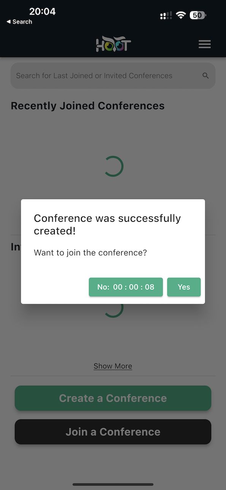

Multi-platform, scalable and resilient [platform](https://hoot.mx) for communication, collaboration and asynchronous information exchange.
Built around a modern design inspired by FaceTime and Skype. Easy installation, powerful API and flexible deployment options allow you to create customised user experience in no time.

 - Scalable: high availability and reliable infrastructure built on AWS, GCP and Azure.

 - Resilient: data is replicated across multiple availability zones for maximum redundancy.

 - Multi-platform: native iPhone and iPad apps, web application and backend API.



 - Scalable: high availability and reliable infrastructure built on AWS.

 - Resilient: data is replicated across multiple availability zones for maximum redundancy.

Create memorable and flexible communication experiences across all digital devices with HooT. HooT's platform is based on a powerful, multi-platform media engine and the most efficient, scalable set of protocols for high performance web conferencing and real time communication.

HooT is built on a cloud-native architecture that provides the flexibility and scalability required to support any type of digital interaction.

The HooT platform is easy to use, reliable and fully secure with strong authentication mechanisms in place. It also includes an easy-to-use web application for both users and administrators that can be accessed from anywhere, anytime.

HooT allows UI & automation developers to leverage it's rich and highly customisable [REST API](https://hoot.mx/api) which is secured by OpenID Connect via Auth0's powerful and highly secure identity platform. HooT is a platform that allows developers to build, deploy and manage fully featured digital customer experiences in real time. It’s a powerful set of APIs and an easy-to-use web application for both users and administrators with strong authentication mechanisms in place.

```shell
#  Obtain a short lived token
export JWT=$(get_hoot_token)

# Create a Conference.
curl -v -H "Authorization: $JWT" \
--data @create_conf.json -X POST \
https://devapi.hoot.mx/v1/create_conference/Kurosawa-Family
```

HooT uses an AI driven mechanism to spawn media-mixing engines, which allows for scale on demand and zero costs in times when business in not active. 