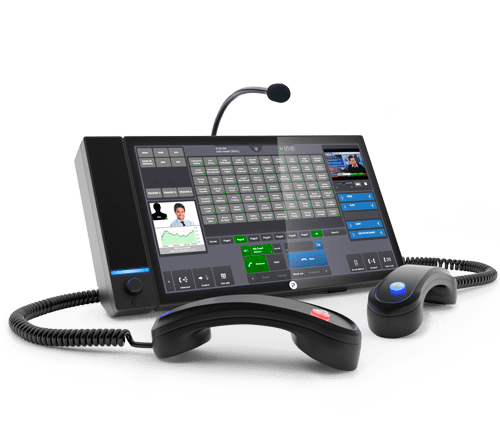

Voice over Internet Protocol (VoIP) and Web Real-Time Communication (WebRTC) are two technologies that have transformed the way we communicate over the internet. In this blog, we will discuss what VoIP and WebRTC are, how they work, and their advantages.

## Voice over Internet Protocol (VoIP)
VoIP is a technology that allows users to make voice and video calls over the internet instead of traditional phone lines. VoIP uses the internet to transmit voice and video data in digital form, allowing for faster and more efficient communication. VoIP has become increasingly popular due to its low cost and convenience, and it is now used by businesses and individuals around the world.

### How VoIP Works
VoIP works by converting analog voice signals into digital data packets that can be transmitted over the internet. When a user makes a VoIP call, their voice is converted into digital data packets that are sent over the internet to the recipient's device. The recipient's device then converts the digital data packets back into analog voice signals, allowing the recipient to hear the caller's voice.

### Advantages of VoIP
One of the main advantages of VoIP is its low cost. VoIP calls are generally cheaper than traditional phone calls, especially for international calls. VoIP also offers advanced features such as call forwarding, voicemail, and caller ID. Additionally, VoIP can be used on a variety of devices including smartphones, tablets, and computers, making it a convenient platform for communication.

## Web Real-Time Communication (WebRTC)
WebRTC is a technology that enables real-time communication between browsers and devices using web-based applications. WebRTC allows users to make voice and video calls, share files, and collaborate on projects without the need for additional software or plugins. WebRTC has become increasingly popular due to its convenience and ease of use.

### How WebRTC Works
WebRTC uses a peer-to-peer (P2P) connection to transmit data between devices, allowing for real-time communication. When a user initiates a WebRTC call, their browser sends a request to the recipient's browser, which responds with their own data. The two browsers then exchange data directly, without the need for a central server. This allows for faster and more efficient communication, as there is no delay caused by server processing.

### Advantages of WebRTC
One of the main advantages of WebRTC is its ease of use. WebRTC can be used on a variety of devices without the need for additional software or plugins. This makes it a convenient platform for communication and collaboration. Additionally, WebRTC offers advanced features such as screen sharing, file sharing, and collaboration tools, making it a versatile platform for businesses and teams.

In conclusion, VoIP and WebRTC are two technologies that have revolutionized the way we communicate over the internet. They offer low cost, convenience, and advanced features, making them popular platforms for businesses and individuals around the world. Whether you are looking to make a voice or video call, share files, or collaborate on a project, VoIP and WebRTC offer efficient and convenient solutions for all your communication needs.

## Applications in Trading & Finance

Voice over Internet Protocol (VoIP) has become an increasingly popular technology in the trading and finance industries. VoIP enables traders and financial professionals to communicate in real-time over the internet, allowing for faster and more efficient communication. In this blog, we will discuss the usage of VoIP in trading and finance and its benefits.

- Real-time communication: VoIP enables traders and financial professionals to communicate in real-time, allowing for faster decision-making and execution. Real-time communication is essential in the trading and finance industries, where market conditions can change rapidly. VoIP allows traders and financial professionals to stay connected and informed at all times, regardless of their location.
- Lower costs: VoIP is generally cheaper than traditional phone lines, making it a cost-effective solution for businesses in the trading and finance industries. VoIP calls are often free or significantly cheaper than traditional phone calls, especially for international calls. This allows businesses to save money on communication costs and invest in other areas of their operations.
- Advanced features: VoIP offers advanced features such as call forwarding, voicemail, and caller ID. These features are essential in the trading and finance industries, where missed calls or delayed messages can result in significant losses. VoIP also allows for conference calls, making it easier for traders and financial professionals to collaborate on projects and strategies.
- Enhanced security: VoIP offers enhanced security features such as encryption, which is important in the trading and finance industries where sensitive information is often exchanged. VoIP encryption ensures that calls and messages are secure and protected from unauthorized access.
- Remote work: VoIP enables traders and financial professionals to work remotely, allowing for greater flexibility and efficiency. Remote work has become increasingly popular in the trading and finance industries, as it allows professionals to work from anywhere in the world. VoIP enables remote workers to stay connected and collaborate with their colleagues, regardless of their location.

In conclusion, VoIP has become an essential technology in the trading and finance industries, enabling real-time communication, lower costs, advanced features, enhanced security, and remote work. As the trading and finance industries continue to evolve, VoIP will play an increasingly important role in facilitating efficient and effective communication. Businesses in these industries should consider implementing VoIP as part of their communication strategy to stay competitive and stay ahead of the curve.

### Digital Trading Turrets

Digital trading turrets are communication systems used in trading rooms and financial institutions for real-time voice communication between traders, brokers, and clients. They are advanced communication systems that enable traders and brokers to access multiple communication channels and tools such as telephone lines, intercom systems, speaker systems, and other electronic devices from a single device.

Digital trading turrets are designed to provide traders and brokers with a secure and efficient communication system, allowing them to communicate with each other and their clients in real-time. They offer a range of advanced features, including:

1. Multiple Lines: Trading turrets enable traders and brokers to handle multiple lines simultaneously, allowing them to communicate with multiple clients at the same time.

2. Intercom Systems: Trading turrets are equipped with intercom systems that enable traders and brokers to communicate with each other directly, without the need for a phone line.

3. Speaker Systems: Trading turrets are equipped with speaker systems that enable traders and brokers to communicate with large groups of people at the same time.

4. Call Recording: Trading turrets can record all calls, providing a record of all transactions and conversations.

5. Encryption: Trading turrets provide a high level of encryption to ensure that all calls are secure and protected from unauthorized access.

6. Digital trading turrets are also equipped with a range of advanced tools such as call routing, call forwarding, speed dialing, and conference calling, making them an essential communication tool in the trading and financial industries. They are designed to meet the specific needs of traders and brokers, providing them with a high level of efficiency, security, and reliability.

In summary, digital trading turrets are communication systems used in trading rooms and financial institutions that provide real-time voice communication between traders, brokers, and clients. They offer a range of advanced features and tools designed to meet the specific needs of traders and brokers, providing them with a secure, efficient, and reliable communication system.

---
## HooT API in Trading Turrets

One of the key benefits of using APIs in trading turrets is the ability to automate and streamline trading workflows. For example, a trader may want to place an order in response to a particular market condition. With an API-enabled trading turret, the trader can automate this process, so that when a certain condition is met, an order is automatically placed through an integrated order management system.

Another benefit of APIs is that they can help reduce the risk of errors and delays in trading workflows. By integrating various systems and applications with the trading turret, traders can eliminate the need for manual data entry and reduce the risk of errors. Additionally, APIs can help reduce delays in the trading process by enabling real-time communication and data exchange between systems.

APIs also enable trading turrets to be customized to meet the specific needs of individual traders and trading desks. For example, traders may have different preferences for the types of data they want to receive, or they may have specific workflows that they want to automate. APIs allow traders to tailor the trading turret system to their specific needs, resulting in a more efficient and effective trading process.