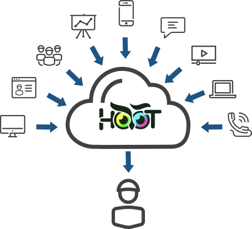

UCAAS stands for Unified Communications as a Service. It is a cloud-based delivery model for enterprise communications applications, such as voice, video, messaging, and collaboration tools.

UCaaS enables businesses to access a suite of communication and collaboration tools through the internet, rather than deploying and maintaining their own hardware and software. This means that businesses can quickly and easily scale their communication capabilities up or down depending on their needs, without the need for significant capital expenditures or IT resources.

UCaaS also provides greater flexibility for remote and mobile workers, as they can access the same communication tools as in-office workers from anywhere with an internet connection. This can improve productivity and collaboration within teams, as well as with customers and partners.



# Technology Landscape in UCaaS

UCaaS (Unified Communications as a Service) utilizes a variety of technologies to enable communication and collaboration. Here are some of the key technologies that are commonly used in UCaaS:

- Voice over Internet Protocol (VoIP): VoIP is a technology that enables voice calls over the internet, rather than using traditional phone lines. UCaaS providers often use VoIP to provide voice communication services to their customers.

- Session Initiation Protocol (SIP): SIP is a signaling protocol used to establish and manage communication sessions in UCaaS. It enables features such as call forwarding, conferencing, and call transfer.

- Web Real-Time Communication (WebRTC): WebRTC is a browser-based technology that allows audio and video communication to take place directly between browsers, without the need for any additional software or plugins. UCaaS providers may use WebRTC to enable browser-based video conferencing and other real-time communication features.

- Instant Messaging (IM): IM is a technology that allows users to send real-time text messages to one another. UCaaS providers may include IM as part of their collaboration tools, allowing users to chat with each other in real-time.

- Presence: Presence technology allows users to see the status of other users in real-time, indicating whether they are available, busy, or away. Presence is often used in UCaaS to enable more effective collaboration and communication between team members.

- Cloud Computing: UCaaS is delivered through the cloud, which allows users to access communication and collaboration tools from anywhere with an internet connection. Cloud computing also enables UCaaS providers to offer flexible and scalable services to their customers.


## Security In UCaaS

Security is a critical consideration for any UCaaS (Unified Communications as a Service) deployment. Here are some of the key security measures that are commonly used in UCaaS:

- Encryption: UCaaS providers often use encryption to protect communication and collaboration tools from unauthorized access. Encryption can prevent eavesdropping, data theft, and other security threats by encoding data in transit and at rest.

- Authentication: UCaaS providers often use authentication methods such as passwords, multi-factor authentication (MFA), and single sign-on (SSO) to verify the identity of users accessing communication and collaboration tools. This can help prevent unauthorized access and data breaches.

- Network Security: UCaaS providers often use network security measures such as firewalls, intrusion detection and prevention systems (IDS/IPS), and virtual private networks (VPNs) to protect against unauthorized access and other security threats.

- Data Backup and Recovery: UCaaS providers often implement backup and recovery solutions to protect against data loss due to natural disasters, hardware failures, and other unforeseen events.

- Compliance: UCaaS providers may comply with various security and privacy regulations such as HIPAA, GDPR, and PCI DSS, depending on the industry and jurisdiction. Compliance helps ensure that UCaaS providers are taking appropriate measures to protect their customers' data.

- User Education and Awareness: UCaaS providers often educate users about security best practices, such as strong passwords, avoiding phishing emails, and protecting sensitive data. This can help reduce the risk of security breaches caused by user error or negligence.


# HooT as UCaaS

HooT.mx uses WebRTC (Web Real-Time Communication) to provide real-time audio and video conferencing capabilities in its web conferencing system. WebRTC is a browser-based technology that enables audio and video communication to take place directly between browsers, without the need for any additional software or plugins.

HooT.mx implements WebRTC through a variety of technologies and protocols, including:

- Signaling Server: HooT.mx uses a signaling server to facilitate communication between browsers. The signaling server is responsible for exchanging session descriptions, candidate addresses, and other metadata between browsers to establish a connection.

- TURN Server: HooT.mx uses a TURN (Traversal Using Relays around NAT) server to enable communication between browsers that are behind firewalls or NATs (Network Address Translators). The TURN server relays traffic between browsers to enable them to communicate even if they cannot connect directly.

- STUN Server: HooT.mx uses a STUN (Session Traversal Utilities for NAT) server to discover the public IP address and port of a browser. This information is necessary to establish a direct peer-to-peer connection between browsers when possible, rather than using the TURN server as an intermediary.

- WebSockets: HooT.mx uses WebSockets to enable real-time communication between browsers and the server. WebSockets provide a bidirectional communication channel between the browser and the server, allowing for real-time updates and messages to be exchanged.

Together, these technologies enable HooT.mx to provide real-time audio and video conferencing capabilities through the browser. Users can join a meeting simply by clicking a link and using their browser, without the need for any additional software or plugins.

## Exploring the Architecture of HooT.mx

The architecture of HooT.mx is designed to provide a scalable, modular, and extensible web conferencing system that can handle large online classrooms and meetings. Here are the main components of the architecture:

1. Client-side: HooT.mx's client-side architecture is based on HTML5 and JavaScript. This enables users to join a meeting using a web browser without the need for any additional software or plugins.

2. Web Server: HooT.mx's web server is built using the Play Framework, a web application framework written in Java. The web server provides the main interface for users to interact with the system, including joining meetings, creating breakout rooms, sharing content, and more.

3. Video Server: The video server is responsible for processing and distributing audio and video streams to meeting participants. It uses open source media servers such as Kurento and Jitsi to provide real-time audio and video conferencing.

4. Recording Server: HooT.mx's recording server is responsible for recording meetings and making them available for playback at a later time. It uses the open source HTML5-based player, which can play back recordings on any device that supports HTML5.

5. Database: HooT.mx's database stores all the metadata related to meetings, users, recordings, and other system components. It uses a SQL database to store this information.

6. Application Programming Interfaces (APIs): HooT.mx provides a set of APIs that enable developers to build custom applications and integrations. These APIs include the REST API, which provides programmatic access to the system's functionality, and the Events API, which enables developers to receive real-time updates on system events.

7. Plugins: HooT.mx's architecture also supports a wide range of plugins that extend the system's functionality. These plugins can be developed by the community or by third-party developers, and can be used to add features such as polling, closed captioning, and more.

Overall, the architecture of HooT.mx is designed to provide a flexible and extensible platform for online learning and collaboration. Its modular design and open APIs enable developers to build custom integrations and extend the functionality of the system as needed.

### Hello World of WebRTC & VoIP

This code creates a WebRTC Peer Connection object and adds an audio stream to it. It then creates a data channel for text chat.

When the user clicks the "call" button, the code creates a new remote Peer Connection, adds an audio stream to it, and listens for incoming text messages on the data channel. The code then exchanges SDP descriptions between the two Peer Connections to establish the VoIP communication.

The user can send text messages by typing them into the chat box and clicking the "send" button. The messages are sent over the data channel.

```js
// Create a WebRTC Peer Connection object
const peerConnection = new RTCPeerConnection();

// Add audio stream to the Peer Connection
const localStream = await navigator.mediaDevices.getUserMedia({audio: true});
localStream.getTracks().forEach(track => peerConnection.addTrack(track, localStream));

// Create a data channel for text chat
const dataChannel = peerConnection.createDataChannel('chat', { ordered: true });

// Set up VoIP communication using WebRTC
const callButton = document.getElementById('call-button');
callButton.addEventListener('click', () => {
  const remotePeer = new RTCPeerConnection();

  // Add audio stream to the remote Peer Connection
  remotePeer.addEventListener('track', event => {
    const remoteAudio = document.getElementById('remote-audio');
    remoteAudio.srcObject = event.streams[0];
  });

  // Receive text messages through the data channel
  remotePeer.addEventListener('datachannel', event => {
    const dataChannel = event.channel;
    dataChannel.addEventListener('message', message => {
      const chatBox = document.getElementById('chat-box');
      chatBox.value += message.data;
    });
  });

  // Exchange SDP descriptions
  peerConnection.createOffer().then(offer => {
    peerConnection.setLocalDescription(offer);
    remotePeer.setRemoteDescription(offer);
    remotePeer.createAnswer().then(answer => {
      remotePeer.setLocalDescription(answer);
      peerConnection.setRemoteDescription(answer);
    });
  });
});

// Send text messages through the data channel
const chatBox = document.getElementById('chat-box');
const sendButton = document.getElementById('send-button');
sendButton.addEventListener('click', () => {
  const message = chatBox.value;
  dataChannel.send(message);
});

```


## Kurento Media Server in more detail

Kurento is an open-source media server that is designed to work with WebRTC (Web Real-Time Communication) to enable real-time audio and video communication in web applications. Kurento is built using Java, and it provides a variety of modules and APIs that enable developers to add advanced multimedia features to their web applications.

Here's how Kurento Media server works with WebRTC:

- Signaling: When two or more web clients want to establish a connection, they need to exchange signaling messages to negotiate the connection. Kurento provides a signaling server that can handle this process and ensure that the clients can establish a connection.

- WebRTC APIs: Kurento provides APIs for WebRTC, which enable developers to create multimedia web applications that can handle real-time audio and video communication.

- Media Processing: Kurento is designed to process media streams in real-time. It can perform a variety of operations on media streams, such as encoding, decoding, filtering, and mixing. These operations can be used to modify or enhance media streams in various ways.

- Media Pipeline: Kurento uses a media pipeline to process media streams. A media pipeline is a sequence of modules that are connected to each other. Each module performs a specific media processing task, and the output of one module is fed into the input of the next module in the pipeline.

- WebRTC Endpoints: Kurento provides WebRTC endpoints that enable clients to connect to the media pipeline. These endpoints can be used to send and receive media streams, and they can be customized to add various multimedia features to the web application.

Overall, Kurento Media server provides a powerful set of tools and APIs that enable developers to create multimedia web applications with advanced features. Its integration with WebRTC makes it an ideal choice for web applications that require real-time audio and video communication, such as video conferencing, live streaming, and online gaming.

### Configuring Kurento

Configuring Kurento Media Server for optimal performance can be a complex process, as it depends on various factors such as the hardware and network environment, the types of media streams being processed, and the specific use case of the application. However, here are some general guidelines that can help optimize the performance of Kurento Media Server:

- Hardware and Network Environment: Kurento Media Server's performance is affected by the hardware and network environment it runs on. To optimize performance, it is recommended to use a server with high CPU, RAM, and network bandwidth. Kurento Media Server should also be installed on a dedicated server to avoid resource contention with other applications.

- Use Efficient Codecs: Kurento Media Server supports a variety of audio and video codecs. To optimize performance, it is recommended to use efficient codecs that provide high quality at low bitrates. Some examples of efficient codecs are Opus for audio and VP9 for video.

- Optimize Media Pipeline: Kurento Media Server's media pipeline can be optimized for performance by reducing the number of modules used, minimizing the number of media streams being processed, and avoiding unnecessary media processing operations.

- Use Caching: Kurento Media Server provides caching mechanisms that can be used to store frequently accessed media streams in memory. This can help reduce the load on the server and improve performance.

- Load Balancing: To handle high traffic, multiple instances of Kurento Media Server can be deployed and load balanced using a load balancer. This helps distribute the load across multiple servers and ensures that each server is operating at optimal capacity.

- Monitoring and Optimization: Kurento Media Server provides various monitoring tools that can be used to monitor the performance of the system. These tools can be used to identify bottlenecks and optimize the system accordingly.

Overall, configuring Kurento Media Server for performance requires a deep understanding of the system's architecture and performance characteristics. By following the above guidelines and continuously monitoring and optimizing the system, it is possible to achieve optimal performance and provide a seamless multimedia experience to users.


### Codecs supported by Kurento

Kurento Media Server supports a wide range of codecs for audio and video streams. Here are some of the codecs supported by Kurento:

#### Audio Codecs:

- Opus
- G.711
- G.722
- AAC
- MP3
- PCM

#### Video Codecs:
- VP8
- VP9
- H.264
- H.265
- MPEG-4
- Theora


Kurento also supports several image and data codecs, such as JPEG, PNG, and JSON. Additionally, Kurento supports transcoding, which enables the server to convert media streams from one format to another, depending on the client's capabilities.

#### Sample code for using Kurento Media Server to process a video stream

```js
// This code creates a Kurento Media Pipeline and adds a GStreamerFilter to flip the video horizontally. Two WebRTC endpoints are then created, one for the video input and one for the output. The filter is connected between the two endpoints to process the video stream.
// The code then generates an SDP offer and sends it to a remote peer, which sends back an SDP answer. The local WebRTC endpoint then sets the SDP answer and starts sending and receiving video.


const kurentoClient = require('kurento-client');
const kurentoMediaPipeline = await kurentoClient.create('MediaPipeline');

// Create WebRTC endpoint for video input
const webRtcEndpoint = await kurentoMediaPipeline.create('WebRtcEndpoint');

// Add filter to process the video stream
const filter = await kurentoMediaPipeline.create('GStreamerFilter', { command: 'videoflip method=horizontal-flip' });
await webRtcEndpoint.connect(filter);

// Create WebRTC endpoint for video output
const webRtcEndpoint2 = await kurentoMediaPipeline.create('WebRtcEndpoint');
await filter.connect(webRtcEndpoint2);

// Start processing the video stream
await webRtcEndpoint.gatherCandidates();
await webRtcEndpoint2.gatherCandidates();

// Offer the SDP description to the remote peer
const offer = await webRtcEndpoint.generateOffer();
// Send the offer to the remote peer and receive the answer
const answer = await remotePeer.processOffer(offer.sdp);
// Set the SDP answer on the local WebRTC endpoint
await webRtcEndpoint2.processAnswer(answer.sdp);

// Start sending and receiving video
await webRtcEndpoint2.connect(webRtcEndpoint);
await webRtcEndpoint.connect(webRtcEndpoint2);
```