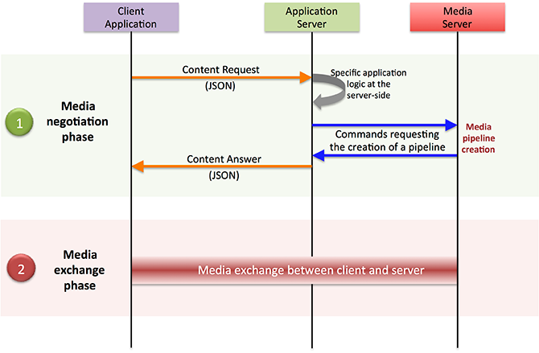

Kurento Media Server (KMS) is an open-source media server that allows developers to build real-time multimedia applications and services. It provides a set of media processing capabilities, including audio and video recording, playback, streaming, and manipulation.

The architecture of Kurento Media Server is based on a modular design that allows it to be easily extended and customized to meet specific requirements. The main components of Kurento Media Server are:

- Media Processing Elements (MPEs): These are the functional modules that perform the actual media processing tasks, such as encoding, decoding, filtering, and mixing. MPEs can be combined in different ways to create complex media processing pipelines.

- Pipeline: A pipeline is a logical sequence of MPEs that are connected to form a processing graph. Each MPE in the pipeline processes the media data and passes it on to the next MPE in the sequence.

- WebRTC Signaling: Kurento Media Server uses WebRTC signaling protocols to establish and manage real-time communication sessions between endpoints. The signaling messages are used to negotiate the session parameters, exchange media data, and control the media processing pipeline.

- Media Server API: Kurento Media Server provides a RESTful API that allows developers to control the media processing pipeline and configure the MPEs. The API also provides access to various media statistics, such as bitrates, frame rates, and packet loss.

- Media Server Client: The media server client is the end-user application that uses the Kurento Media Server to perform real-time media processing tasks. The client can be a web-based application, a mobile application, or a desktop application.

Overall, the architecture of Kurento Media Server is designed to be flexible and scalable, allowing developers to create customized media processing solutions for a wide range of use cases.

```
         +-------------------+
         | Media Server API   |
         +-------------------+
         |                   |
         | RESTful Interface |
         |                   |
         +-------------------+
         |                   |
         | Media Processing  |
         |                   |
         +---------+---------+
                   |
                   |
                   v
         +---------+---------+
         |   Pipeline        |
         +---------+---------+
                   |
                   |
                   v
         +---------+---------+
         | Media Processing  |
         | Element (MPE)     |
         +---------+---------+
                   |
                   |
                   v
         +---------+---------+
         |   WebRTC Signaling |
         +-------------------+

```

As shown in the diagram, the Media Server API provides a RESTful interface for controlling the media processing pipeline and accessing media statistics. The pipeline consists of a sequence of MPEs that process media data, and the WebRTC Signaling is used to establish and manage real-time communication sessions between endpoints. The Media Server Client interacts with the Media Server API to control the pipeline and perform real-time media processing tasks.

## WebRTC Signalling

WebRTC signaling is an essential component of the real-time communication system enabled by Kurento Media Server. It enables endpoints to negotiate and establish communication channels over the internet.

In the context of Kurento Media Server, WebRTC signaling is used to establish and manage real-time communication sessions between endpoints. This includes protocols like SDP (Session Description Protocol) and ICE (Interactive Connectivity Establishment).

Here's how WebRTC signaling works within Kurento Media Server:

- WebRTC Offer/Answer: When an endpoint wants to establish a WebRTC session with another endpoint, it sends an offer message that includes information about its capabilities, such as the codecs it supports, and the transport protocols it can use. The other endpoint responds with an answer message that includes its capabilities.

- ICE Candidates: Once the endpoints have exchanged offer and answer messages, they need to determine the best network path to use for the communication session. Each endpoint generates a list of ICE candidates, which are potential network paths that can be used for communication. The endpoints exchange these ICE candidates and use them to establish a direct peer-to-peer connection.

- SDP Negotiation: Once the endpoints have established a direct connection, they use the Session Description Protocol (SDP) to negotiate the details of the communication session. This includes the media types (e.g., audio or video), the codecs, and the transport protocols to be used for each media type.

- Media Pipeline: Once the SDP negotiation is complete, Kurento Media Server sets up a media processing pipeline based on the negotiated parameters. The pipeline consists of a sequence of Media Processing Elements (MPEs) that process the media data, such as encoding, decoding, filtering, and mixing.

- Real-time Communication: With the media pipeline in place, the endpoints can start to exchange media data in real-time, using the agreed-upon media formats and protocols.

In summary, WebRTC signaling within Kurento Media Server is used to establish and manage real-time communication sessions between endpoints. It enables endpoints to negotiate the details of the communication session, determine the best network path, and establish a direct peer-to-peer connection. Once the connection is established, Kurento Media Server sets up a media processing pipeline that processes the media data in real-time.

```
              Endpoint A                  Endpoint B
                  |                            |
                  |                            |
                  |                            |
           (1) Offer SDP               (2) Answer SDP
                  |                            |
                  |                            |
                  |                            |
     +--------------+--------------+ +--------------+--------------+
     |                              | |                              |
     |  (3) ICE Candidate Exchange  | |  (3) ICE Candidate Exchange  |
     |                              | |                              |
     +--------------+--------------+ +--------------+--------------+
                  |                            |
                  |                            |
                  |                            |
            (4) SDP Negotiation          (4) SDP Negotiation
                  |                            |
                  |                            |
                  |                            |
     +--------------+--------------+ +--------------+--------------+
     |                              | |                              |
     |       (5) Real-time           | |       (5) Real-time           |
     |    Communication Begins      | |    Communication Begins      |
     |                              | |                              |
     +------------------------------+ +------------------------------+

```
The diagram shows two endpoints, A and B, that want to establish a WebRTC communication session using Kurento Media Server. Here's how the signaling process works:

- Endpoint A sends an Offer SDP message to Kurento Media Server, which includes information about its capabilities, such as the codecs it supports, and the transport protocols it can use.
- Kurento Media Server forwards the Offer SDP message to Endpoint B, which responds with an Answer SDP message that includes its capabilities.
- Endpoint A and Endpoint B exchange ICE candidates, which are potential network paths that can be used for communication. The ICE candidates are used to determine the best network path for the communication session.
- Endpoint A and Endpoint B negotiate the details of the communication session using SDP. They agree on the media types (e.g., audio or video), the codecs, and the transport protocols to be used for each media type.
- With the communication parameters negotiated, real-time communication begins between Endpoint A and Endpoint B. Media data is exchanged using the agreed-upon media formats and protocols.
In summary, WebRTC signaling within Kurento Media Server enables endpoints to negotiate and establish real-time communication sessions, using protocols like SDP and ICE. The signaling process ensures that the endpoints agree on the media formats, codecs, and transport protocols to be used for the communication session, and establish a direct peer-to-peer connection for efficient data transfer.



## ICE Candidates

In WebRTC, Interactive Connectivity Establishment (ICE) is used to establish a direct peer-to-peer connection between endpoints, which is necessary for real-time communication. ICE candidates are network addresses that are used by ICE to establish a direct connection between endpoints.

In WebRTC, there are two types of ICE candidates: host candidates and server-reflexive candidates.

- Host Candidates: A host candidate is an IP address and port number associated with the device where the endpoint is running. These are local network addresses of the endpoint's machine that can be used for direct communication if both endpoints are on the same network.

- Server-Reflexive Candidates: Server-reflexive candidates are network addresses that are obtained by sending a request to a STUN (Session Traversal Utilities for NAT) server. These candidates are obtained by using a NAT traversal technique that allows the endpoint to determine its public IP address and port number, which can be used for communication with endpoints outside of its local network.

To determine the ICE candidates, WebRTC endpoints perform a series of steps:

- Each endpoint collects a list of its local IP addresses and ports. These are the host candidates.

- Each endpoint sends a STUN request to a STUN server. The STUN server responds with a server-reflexive candidate, which includes the public IP address and port number of the endpoint.

- If the endpoints are unable to establish a direct connection using host and server-reflexive candidates, they may also use other types of candidates such as relay candidates, which are obtained by using a TURN (Traversal Using Relay NAT) server.

- The endpoints exchange their list of ICE candidates over the signaling channel and use them to establish a direct connection.

The ICE negotiation process continues until a direct connection is established between the endpoints or until all candidate types have been exhausted. The ICE negotiation process is important for WebRTC communication because it allows endpoints to establish a direct connection even when they are behind firewalls and NATs that would otherwise prevent direct communication.

### Configuring ICE

To configure ICE candidates in Kurento Media Server, you typically follow these steps:

- Collect the local IP addresses and ports that can be used as ICE candidates for the WebRTC endpoint.

- Create an `IceCandidate` object for each candidate, specifying the candidate's transport protocol, IP address, port number, and any other relevant properties.

- Add the `IceCandidate` objects to the WebRTC endpoint's `WebRtcEndpoint` using the addIceCandidate method.

- Wait for the remote endpoint to send its SDP offer, which includes its own ICE candidates.

- Process the remote endpoint's SDP offer to determine its ICE candidates.

- Add the remote endpoint's ICE candidates to the WebRTC endpoint's WebRtcEndpoint using the addIceCandidate method.

- Start the ICE connectivity checks between the endpoints to determine the best candidate pair for establishing a direct connection.

```java
// Create a new IceCandidate object with the candidate properties
IceCandidate candidate = new IceCandidate.Builder()
        .withFoundation("foundation")
        .withComponentId(1)
        .withTransport("UDP")
        .withPriority(12345678)
        .withIp("192.168.1.100")
        .withPort(1234)
        .withType(CandidateType.HOST)
        .withGeneration(0)
        .build();

// Get the WebRtcEndpoint to which the IceCandidate will be added
WebRtcEndpoint webRtcEndpoint = ...;

// Add the IceCandidate to the WebRtcEndpoint
webRtcEndpoint.addIceCandidate(candidate);
```

## Bandwidth Management within KMS

Bandwidth management and configuration is an important aspect of optimizing the performance of media streams in Kurento Media Server. Kurento provides several mechanisms to manage bandwidth usage, including:

1. Bitrate Adaptation: Kurento can automatically adjust the bitrate of media streams based on network conditions and available bandwidth. This can help improve the quality of media while avoiding congestion and packet loss.

2. Dynamic Bandwidth Allocation: Kurento can allocate bandwidth dynamically to media streams based on their priority, size, and other parameters. This can help ensure that critical media streams receive sufficient bandwidth while minimizing the impact on other streams.

3. Congestion Control: Kurento can detect and respond to network congestion by reducing the bitrate of media streams or dropping packets selectively. This can help prevent network overload and improve overall performance.

To configure bandwidth management in Kurento Media Server, you can use the following settings:

- `maxOutputBitrate`: This property sets the maximum output bitrate that can be used by media streams in Kurento. It can be set globally or for individual media elements and endpoints.

- `minOutputBitrate`: This property sets the minimum output bitrate that should be used by media streams in Kurento. It can be used to ensure that media streams maintain a minimum quality level even in low bandwidth conditions.

- `adaptationSet`: This property configures the bitrate adaptation algorithm used by Kurento. It can be set to different values, such as "fixed", "fluid", or "manual", depending on the desired behavior.

- `priority`: This property sets the priority of individual media streams in Kurento. Higher priority streams will receive more bandwidth allocation and higher quality.

#### Example of configuring bandwidth using Kurento API
```python
from kurento_client import KurentoClient, MediaPipeline, WebRtcEndpoint

# Create a Kurento Client object
kurento_client = KurentoClient('ws://localhost:8888/kurento')

# Create a new media pipeline
pipeline = kurento_client.create('MediaPipeline')

# Create a WebRTC endpoint and connect it to the pipeline
webrtc = WebRtcEndpoint.Builder(pipeline).build()
webrtc.connect(webrtc)

# Configure bandwidth management settings
webrtc.set_max_output_bitrate(1000) # Set max output bitrate to 1000 kbps
webrtc.set_min_output_bitrate(500) # Set min output bitrate to 500 kbps
webrtc.set_priority(1) # Set priority to 1

# Start the media pipeline and WebRTC endpoint
pipeline.play()
webrtc.gather_candidates()

# Use the WebRTC endpoint to transmit and receive media

```

## Media Profile in Kurento

#### Example - configuring media profiles in KMS
```java
import org.kurento.client.*;
import org.kurento.client.MediaProfileSpecType;
import org.kurento.client.MediaProfileSpec;

// Create a new media pipeline
MediaPipeline pipeline = kurento.createMediaPipeline();

// Create a new WebRTC endpoint and connect it to the pipeline
WebRtcEndpoint webrtc = new WebRtcEndpoint.Builder(pipeline).build();
webrtc.connect(webrtc);

// Configure media profile settings
MediaProfileSpec mediaProfile = new MediaProfileSpec.Builder()
    .withVideoCodec(VideoCodec.H264)
    .withAudioCodec(AudioCodec.OPUS)
    .withTransport(Transport.TCP)
    .withMediaType(MediaProfileSpecType.WEBM)
    .withMaxVideoBitrate(2000)
    .withMaxAudioBitrate(128)
    .withMinVideoBitrate(1000)
    .withMinAudioBitrate(64)
    .build();
webrtc.setMediaProfile(mediaProfile);

// Start the media pipeline and WebRTC endpoint
pipeline.play();
webrtc.gatherCandidates();

// Use the WebRTC endpoint to transmit and receive media

```

## Analytics in KMS

Kurento Media Server supports integration with different analytics tools, such as monitoring systems, data processing platforms, and machine learning models.

```python
from kurento_client import KurentoClient, MediaPipeline, MediaElement

# Create a Kurento client instance
kurento_client = KurentoClient('ws://<your-kms-address>:8888/kurento')

# Create a media pipeline
pipeline = kurento_client.create('MediaPipeline')

# Create a media element, for example a WebRTC endpoint
webrtc = pipeline.create('WebRtcEndpoint')

# Enable gathering of stats for the endpoint
webrtc.enable_stats_events('EndpointStats')

# Connect the endpoint to other media elements in the pipeline
# ...

# Start the pipeline
pipeline.play()

# Get stats for the endpoint
stats = webrtc.get_stats()

# Process the stats
# ...

# Release resources
webrtc.release()
pipeline.release()
kurento_client.close()
```

## Use Case Studies

### AI Based QoS in KMS

AI-based Quality of Service (QoS): Kurento can be integrated with AI algorithms to monitor and optimize the QoS of media streams. AI-based QoS algorithms can automatically adjust the media stream parameters such as resolution, bitrate, frame rate, and more based on network conditions, device capabilities, and user preferences.

#### Example of AI based QoS with Tensorflow 
```python
from kurento_client import MediaPipeline, WebRtcEndpoint
import tensorflow as tf

class AIQoS:
    def __init__(self, pipeline: MediaPipeline, webrtc: WebRtcEndpoint):
        self.pipeline = pipeline
        self.webrtc = webrtc
        self.sess = tf.Session()
        self.graph = self.build_graph()
        self.qos = self.graph.get_tensor_by_name('qos:0')
        
    def build_graph(self):
        graph = tf.Graph()
        with graph.as_default():
            input_tensor = tf.placeholder(tf.float32, shape=[None, 2])
            output_tensor = tf.layers.dense(input_tensor, 1, activation=tf.sigmoid, name='qos')
        return graph
    
    def adjust_qos(self, bandwidth: float):
        input_data = [[self.webrtc.getMeasuredLatency(), bandwidth]]
        qos_value = self.sess.run(self.qos, feed_dict={self.graph.get_tensor_by_name('Placeholder:0'): input_data})
        self.webrtc.setVideoMaxBandwidth(qos_value * bandwidth)

```

### Speech Recognition & NLP using KMS

Machine Learning (ML) based image and speech recognition: Kurento can be integrated with ML libraries such as TensorFlow, Keras or OpenCV to perform tasks such as object detection, facial recognition, emotion detection, speech recognition, and more. Kurento can process media streams and provide results to the ML algorithms, which can then provide intelligent insights.

Natural Language Processing (NLP): Kurento can be integrated with NLP libraries such as NLTK or spaCy to perform tasks such as sentiment analysis, topic extraction, entity recognition, and more. Kurento can provide the audio or text data to NLP algorithms and receive intelligent insights.

#### Example KMS integration with Google Cloud Speech-to-Text API.
```python
from google.cloud import speech
import kurento_client

class SpeechRecognition:
    def __init__(self, pipeline: kurento_client.MediaPipeline, webrtc: kurento_client.WebRtcEndpoint, language_code: str):
        self.pipeline = pipeline
        self.webrtc = webrtc
        self.language_code = language_code
        self.client = speech.SpeechClient()
        self.streaming_config = speech.StreamingRecognitionConfig(
            config=speech.RecognitionConfig(
                encoding=speech.RecognitionConfig.AudioEncoding.OPUS,
                sample_rate_hertz=48000,
                language_code=language_code,
                model='default'
            ),
            interim_results=True
        )
        self.recognize_stream = self.client.streaming_recognize(self.streaming_config)

    def on_sdp_offer(self, offer, on_response):
        answer = offer
        answer.sdp = self.webrtc.process_offer(offer.sdp)
        on_response(answer)

    def on_ice_candidate(self, candidate):
        self.webrtc.add_ice_candidate(candidate)

    def start_recognition(self):
        self.webrtc.connect(self.pipeline)
        self.pipeline.play()
        self.webrtc.gatherCandidates()

        for chunk in self.webrtc.get_media_element().connect(self.pipeline).pull():
            if not self.webrtc.get_media_element().is_paused():
                self.recognize_stream.write(chunk)

        self.recognize_stream.close()

        for response in self.recognize_stream:
            for result in response.results:
                if result.is_final:
                    print(result.alternatives[0].transcript)
                else:
                    print(result.alternatives[0].transcript, end='')

```

#### Example: using the `SpeechRecognition` class

```python
import kurento_client
import sys
import time

kurento_client.KurentoClient.register_modules('kurento.modules.webRtcEndpoint', 'kmsserver.kurento')

pipeline = kurento_client.MediaPipeline()

webrtc = kurento_client.WebRtcEndpoint.Builder(pipeline).build()

speech_recognition = SpeechRecognition(pipeline, webrtc, 'en-US')

@speech_recognition.on('sdp_offer')
def on_sdp_offer(offer):
    print('Received SDP offer')
    answer = None
    speech_recognition.on_sdp_offer(offer, lambda a: nonlocal answer; answer = a)
    return answer

@speech_recognition.on('ice_candidate')
def on_ice_candidate(candidate):
    print('Received ICE candidate')
    speech_recognition.on_ice_candidate(candidate)

speech_recognition.start_recognition()

webrtc.connect(webrtc)

with open(sys.argv[1], 'rb') as f:
    while True:
        chunk = f.read(960)
        if not chunk:
            break
        webrtc.send_data(chunk)
        time.sleep(0.01)

webrtc.disconnect(webrtc)

pipeline.release()

```