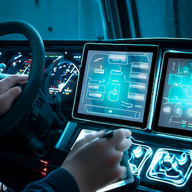
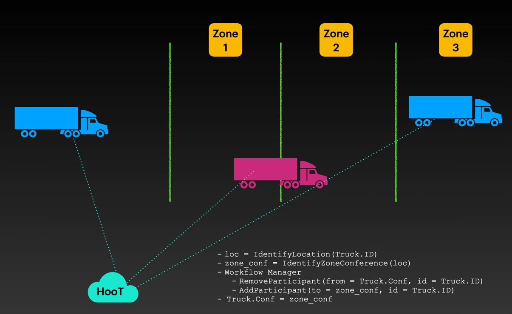

The Command and Control (C2) market with respect to fleets of vehicles refers to the technology, software, and services that enable military, government, and commercial organizations to manage and control their fleets of vehicles in real-time.

In this market, C2 systems via HooT API are used to coordinate the movement, positioning, and deployment of vehicles, such as military convoys, emergency response vehicles, commercial fleets, and public transportation. 
These systems use advanced technologies, such as GPS tracking, internet communication, and integration with collaboration engines to provide situational awareness, decision-making support, and efficient resource allocation.

HooT's API platform with respect to fleets of vehicles includes a range of solutions, from standalone software applications to integrated hardware and software systems. 
The API can be customized to meet the specific needs of each organization, depending on the size of the fleet, the type of vehicles, the nature of the mission, and the operational environment.



The demand for C2 systems in the fleet management market is driven by the increasing need for efficient and secure vehicle operations, improved situational awareness, and real-time decision-making support. This market is expected to continue growing as the demand for advanced fleet management solutions increases, especially in the military and emergency response sectors.

## The HooT Application

A major fleet management company can automate and relay fleet missions, broadcast alerts, and enable fleet-client communication dynamically with geospatial awareness and realtime information.

### Mission

The mission is to send deliveries across a large metropolitan, while enabling

- real-time awareness of the current zone
- update of mission and new workflow adoption
- client to vehicle communication for any modifications in the plan
- group communication within fleets
- point-to-point channel with the vehicle-driver

Delivery of aforementioned workflows can be achieved with an internet-enabled, smart-phone or tablet installed in the vehicle.

#### Real-time conference switches and awareness

Using `CoreLocation` in iOS and `Geocoder` in Android, identifying the location of a vehicle and then pinning it to a contextual travel-zone can be accomplished.
Every geographically demarcated travel-zone will have an automatically created conference bridge of it's own.

Upon entering a new zone, the vehicle could automatically join the conference bridge of that zone for real-time mission updates and regional updates.



**Sample Code for workflow**

Getting the location from device
```kotlin
// Android
import android.Manifest
import android.content.Context
import android.content.pm.PackageManager
import android.location.Location
import androidx.core.app.ActivityCompat
import com.google.android.gms.location.FusedLocationProviderClient
import com.google.android.gms.location.LocationServices

fun getCurrentLocation(context: Context, callback: (Location?) -> Unit) {
    val fusedLocationClient: FusedLocationProviderClient = LocationServices.getFusedLocationProviderClient(context)
    
    if (ActivityCompat.checkSelfPermission(context, Manifest.permission.ACCESS_FINE_LOCATION) != PackageManager.PERMISSION_GRANTED) {
        // Permission not granted, handle accordingly
        callback(null)
        return
    }
    
    fusedLocationClient.lastLocation.addOnSuccessListener { location: Location? ->
        // Got last known location. In some rare situations this can be null.
        callback(location)
    }
}
```

Using the location function
```kotlin
getCurrentLocation(this) { location ->
    // Do something with the location object
    if (location != null) {
        val latitude = location.latitude
        val longitude = location.longitude
        // ...
    } else {
        // Location is null, handle accordingly
    }
}
```

API for adding/removing from conference 

```shell
# Remove the truck_id from previous_zone_conf_id
curl -v -H "Authorization: $JWT" \
  -X POST --data '{"remove_users": truck_id,..}' \
  https://devapi.hoot.mx/v1/edit_conference/{previous_zone_conf_id}
  
# Add the truck to new_zone_conf_id
curl -v -H "Authorization: $JWT" \
  -X POST --data '{"new_participants": truck_id,..}' \
  https://devapi.hoot.mx/v1/edit_conference/{new_zone_conf_id}
```

#### Mission Updates

- Live chats can be relayed to all conference users
- Priority of notifications can be decided by the admin-relayer

#### Client to Vehicle Communication

During the course of mission, upcoming milestones can trigger a communication link to the milestone client.

The milestone-client, in case of exceptions and emergencies can join the communication link via web on their mobile devices and communicate about the situation.

**Algorithm**

1. Identify next N milestones
2. Invite the milestone clients to join a unique link to communicate about their situation if they need to.
3. Remove the links once the milestone is complete.

```python
def milestone_communications(truck, next_communication_size=5):
    for milestone in truck.milestones[:next_communication_size]:
        truck.send_comm_link(milestone.client_comm_address)
```

#### Group Communications and Event Notification

The truck could automatically subscribe to the event-loop using the [glayr-api](/docs/glayr).

All the urgent-communication events would then flash with the name of the relayer on the dashboard of the driver.

Similarly, for the admin to directly communicate with the truck on a private secure channel, they can invoke the API to kickstart the collaboration.


## Advanced Usage

Using AI and collaborating with our team of engineers and data-scientists we can create innovative ways to identify certain situations.

One of the use-cases our team came across was to identify distress from conference voice streams.

**Goal: Distress Identification from fleet conferences.** 

1. We created a model trained to detect distress in voice streams.
2. We deployed an `analyzer` to our Kurento media stream
3. Identified the distress.


```python
import tensorflow as tf
import numpy as np
from kurento.client import KurentoClient, MediaPipeline, MediaElement, MediaPad, WebRtcEndpoint

# Define the TensorFlow model and input/output tensors
model = tf.keras.models.load_model('distress_model.h5')
input_tensor = model.inputs[0]
output_tensor = model.outputs[0]

# Connect to Kurento Media Server
kurento_client = KurentoClient('ws://localhost:8888/kurento')
pipeline = kurento_client.create('MediaPipeline')
webrtc = pipeline.create('WebRtcEndpoint')
webrtc.connect(pipeline)

# Create a GStreamer element that captures the voice stream and feeds it to the TensorFlow model
caps = 'audio/x-raw,format=S16LE,channels=1,layout=interleaved,rate=44100'
src_element = pipeline.create('GstAppSrc', caps=caps)
src_pad = src_element.create_src_pad()
src_element.connect('need-data', on_need_data)

# Define the callback function that processes the voice stream with the TensorFlow model
def on_need_data(src, length):
    # Get the voice stream data from the Kurento WebRtcEndpoint
    data = webrtc.emit('generate-data-event', length)

    # Preprocess the data for the TensorFlow model
    audio = np.frombuffer(data, np.int16)
    audio = tf.audio.encode_wav(audio, sample_rate=44100)
    audio = tf.io.decode_wav(audio.content)[0]
    audio = tf.expand_dims(audio, axis=0)

    # Pass the data through the TensorFlow model to make a prediction
    prediction = model.predict(audio)[0]
    if prediction[0] > prediction[1]:
        # No distress detected
        print('No distress detected')
    else:
        # Distress detected
        print('Distress detected')
```

This code uses TensorFlow to load a pre-trained model that has been trained to detect distress in voice streams.
It then creates a Kurento Media Pipeline and a WebRtcEndpoint. 
The GStreamer element `GstAppSrc` is used to capture the voice stream from the `WebRtcEndpoint` and feed it to the TensorFlow model. The on_need_data callback function is called whenever new data is available, and it processes the data with the TensorFlow model to make a prediction. 
If the model predicts that distress is present in the voice stream, the callback function outputs a message indicating that distress has been detected.

Note that this is a simple example and that the TensorFlow model used in this code is just a placeholder. 
In practice, you would need to train a more sophisticated model on a large dataset of distressful voice streams in order to achieve accurate results.

In a future blog we will discuss training voice-distress models in more detail.