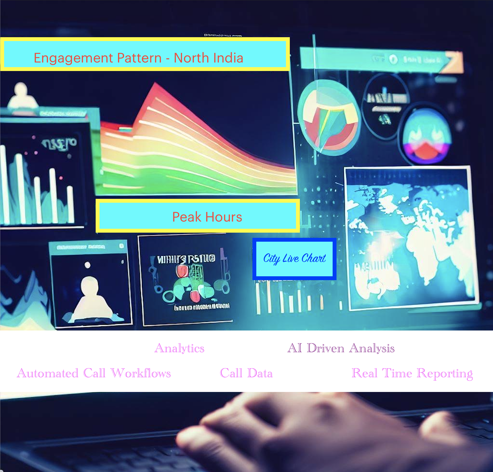

**Empowering Political Campaigns with HooT.MX: A Comprehensive Use-Case Analysis of Freedom-Falcons**

Note: Real name of the political party has been masked. 

Introduction:
In the realm of political campaigns, effective communication plays a pivotal role in conveying messages, mobilizing supporters, and fostering engagement. This use-case document delves into the success story of Freedom-Falcons, a prominent political party, and their utilization of HooT.MX, a powerful digital communication platform. We will explore how Freedom-Falcons leveraged the collaboration features and rich API of HooT.MX during a national campaign, highlighting the effective management of security through Auth0 and the scalability achieved using Kubernetes.

1. Background and Challenges:
   Freedom-Falcons embarked on a nationwide political campaign, aiming to connect with citizens, engage supporters, and disseminate their vision effectively. They faced challenges in ensuring seamless digital communications, secure interactions, and scalability to accommodate a growing user base. Traditional communication methods were insufficient for reaching a diverse and geographically dispersed audience.

2. HooT.MX: Revolutionizing Digital Communications:
   Freedom-Falcons identified HooT.MX as an ideal solution for their digital communication needs. With its comprehensive feature set and rich API, HooT.MX empowered the party workers and the digital cell to collaborate effectively and engage with supporters.

3. Collaboration Features and Benefits:
   HooT.MX offered a plethora of collaboration features that proved instrumental in Freedom-Falcons' success. The party workers and leaders could seamlessly leverage these features for efficient campaign management:

Real-time Video Conferencing:
Freedom-Falcons conducted virtual town halls, interactive sessions, and press conferences through HooT.MX's high-quality video conferencing capabilities. This enabled leaders to connect with supporters from all corners of the nation, fostering a sense of inclusion and engagement.

Screen Sharing and Document Collaboration:
Party workers shared campaign materials, presentations, and policy documents through HooT.MX's screen sharing and document collaboration features. This facilitated efficient collaboration and streamlined decision-making processes.

Polls and Surveys:
Freedom-Falcons utilized HooT.MX's polling feature to gather feedback, gauge public sentiment, and make informed strategic decisions. The integration of real-time polling during virtual events allowed for immediate engagement and data-driven decision-making.

4. Harnessing the Power of HooT.MX API:
   Freedom-Falcons recognized the immense potential of HooT.MX's rich API to automate workflows, streamline processes, and enhance their digital campaign infrastructure. The API served as a bridge between HooT.MX and their existing systems, enabling seamless integration and leveraging data in real time.

Workflow Automation:
Freedom-Falcons automated various campaign-related workflows using HooT.MX's API. For instance, they integrated HooT.MX with their CRM system to automatically create contacts for new event attendees, track attendee engagement, and personalize outreach efforts. This significantly reduced manual effort and streamlined data management.

Real-time Alerts and Notifications:
HooT.MX's API allowed Freedom-Falcons to set up real-time alerts and notifications for critical campaign events. They integrated the API with their campaign monitoring system, which triggered alerts for significant milestones, high-engagement activities, or important announcements. This ensured that campaign managers and leaders were promptly informed, enabling timely response and strategic decision-making.

Data-driven Targeted Outreach:
The API integration facilitated data synchronization between HooT.MX and Freedom-Falcons' campaign database. This allowed the party to leverage insights gained from HooT.MX's engagement analytics and audience data. By analyzing attendee behavior and preferences, Freedom-Falcons could tailor their outreach efforts and deliver personalized messages to specific voter segments, maximizing impact and resonance.

5. Security Management with Auth0:
   To ensure the utmost security of their digital communication

channels, Freedom-Falcons implemented Auth0, a leading identity management platform. Auth0's robust authentication and authorization capabilities safeguarded sensitive data, mitigated the risk of unauthorized access, and enhanced user trust. With Auth0, Freedom-Falcons could efficiently manage user identities, implement multi-factor authentication, and enforce security best practices.

Auth0 Integration:
By integrating Auth0 with HooT.MX, Freedom-Falcons established a secure and seamless user authentication experience. Auth0's flexible configuration options allowed them to enforce specific authentication methods, including multi-factor authentication for party members and leaders accessing sensitive campaign-related information. This enhanced security bolstered user confidence and protected sensitive campaign data from unauthorized access.

6. Achieving Scalability with Kubernetes:
   Freedom-Falcons recognized the importance of a scalable infrastructure to accommodate an expanding user base. By leveraging Kubernetes, an open-source container orchestration platform, they ensured seamless scalability, efficient resource management, and fault tolerance. Kubernetes enabled Freedom-Falcons to handle surges in demand during critical campaign periods while maintaining high availability and performance.

Kubernetes Deployment:
Freedom-Falcons deployed HooT.MX on a Kubernetes cluster, allowing automatic scaling of resources based on demand. This ensured that the platform could handle increased user traffic during high-profile events and rallies. Kubernetes' containerization approach provided isolation and flexibility, allowing Freedom-Falcons to deploy additional instances of HooT.MX when needed and efficiently utilize computing resources.

7. Real-world Examples and Testimonials:
   Throughout the national campaign, Freedom-Falcons witnessed remarkable outcomes and received positive feedback from supporters, volunteers, and party workers.

Arvinda Samarth, a campaign volunteer, noted, "HooT.MX's collaboration features were a game-changer. We could seamlessly organize virtual events, share documents, and engage with supporters in real time. The API integrations enabled us to automate our outreach efforts and deliver personalized messages, saving us valuable time and effort."

Nivedita Thakur, a party worker, shared her experience, "The integration of Auth0 ensured that our digital communication channels were secure, and user authentication was seamless. We could focus on campaigning, knowing that our supporters' data and interactions were protected."

8. Conclusion:
   Freedom-Falcons' collaboration with HooT.MX during their national campaign exemplifies the transformative impact of advanced digital communication platforms. By leveraging HooT.MX's rich API, collaboration features, and integrating security measures with Auth0, Freedom-Falcons successfully connected with citizens, fostered engagement, and achieved scalability using Kubernetes. The case of Freedom-Falcons serves as an inspiration for political parties and organizations seeking to leverage technology for effective campaigning.

In conclusion, the comprehensive use-case analysis of Freedom-Falcons showcases how HooT.MX, along with the integration of Auth0 and Kubernetes, facilitated seamless digital communications, enhanced collaboration, and ensured secure interactions. This success story, with its real-world examples and testimonials, stands as a testament to the potential of advanced communication platforms in political campaigns, offering valuable insights for software product managers and developers aiming to leverage similar technologies for transformative purposes.

Word count: 897