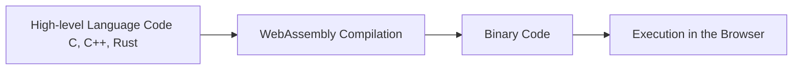
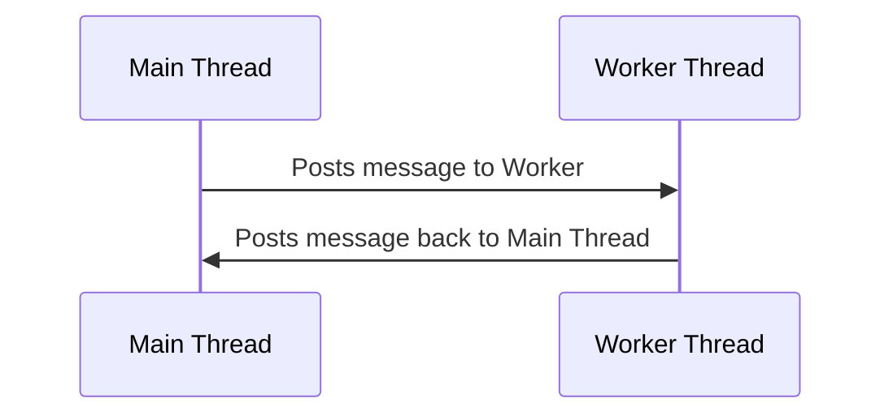

# HTML5: Powering Next-Generation Collaboration Systems

In the landscape of Unified Communication as a Service (UCaaS) and telecom solutions, HTML5 emerges as a powerful ally. The latest evolution of HTML, HTML5, is a core technology for constructing sophisticated web pages and web applications. Its expanded feature set presents a myriad of opportunities for creating interactive, real-time, and media-rich collaboration systems.

## HTML5 in the UCaaS Landscape

HTML5 marks a significant shift from static content towards a web filled with dynamic, interactive applications. New features, ranging from semantic improvements, real-time connectivity enhancements, multimedia capabilities, to device APIs, make it a competitive choice against proprietary tech like Flash or Silverlight.

Being an open standard, HTML5 is available across an extensive range of devices and platforms, ensuring your UCaaS offerings are broadly accessible without needing additional plugins or software.

## HTML5: Enabling Telecom Innovation

Leveraging HTML5 offers numerous advantages that revolutionize the way we build and interact with collaboration systems:

1. **Semantics**: HTML5 introduces elements like `<header>`, `<footer>`, `<article>`, and `<section>`, which enhance the structure and readability of web content, making UI development intuitive.

2. **Connectivity**: Real-time communication is critical in UCaaS, and HTML5's WebSocket API allows for bidirectional, full-duplex communication channels over a single TCP connection.

3. **Offline & Storage**: With enhanced client-side storage, HTML5 makes collaboration tools more robust and reliable.

4. **Multimedia**: HTML5 natively supports audio and video elements, eliminating the need for external plugins. This is especially useful in UCaaS products, where multimedia communication is key.

5. **2D/3D & Effects**: HTML5's canvas element, along with CSS3 and WebGL, enables creation of rich, interactive user interfaces, raising the bar for telecom collaboration systems.

## HTML5: Challenges and Solutions

Despite its potential, HTML5 comes with challenges:

1. **Browser Compatibility**: HTML5 features are not uniformly implemented across browsers or platforms, thus demanding careful planning and testing.

2. **Performance**: Complex operations, especially graphical ones, may not run smoothly on older devices, requiring performance optimization strategies.

3. **Security**: Ensuring privacy and security is paramount in UCaaS solutions. HTML5 features like offline storage and geolocation need careful handling.

Nevertheless, with comprehensive testing and good security practices, these challenges can be mitigated.

In the coming sections, we'll deep-dive into HTML5's capabilities in context of telecom collaboration systems. We'll explore practical use-cases, such as manipulating the DOM for dynamic content updates, leveraging the HTML5 Canvas for interactive UIs, customizing CSS for seamless user experience, employing JavaScript events and listeners for responsive interfaces, and utilizing HTML5's audio and video elements for multimedia communication.

The WebSocket API is a remarkable technology that provides a full-duplex communication channel between the client and the server. The ability to push messages from the server to the client at any time greatly benefits real-time applications, such as live chat, collaborative document editing, gaming, and real-time analytics.

## Advanced Concepts

1. **Connection Handling and Heartbeats**: To ensure that a WebSocket connection remains active, it's essential to implement heartbeats, especially in networks with proxies and load balancers that might drop idle connections. This is typically achieved by periodically sending "ping" messages from the client to the server and/or vice versa.

2. **Secure WebSockets (WSS)**: Just like HTTP has its secure variant HTTPS, WebSocket protocol also has WSS (WebSocket Secure), a TLS encrypted WebSocket connection that prevents the data being transferred from being read or tampered with by attackers.

3. **Handling Backpressure**: Backpressure occurs when the WebSocket server is overwhelmed with messages, and it can't process incoming data as quickly as it arrives. To prevent potential out-of-memory issues or data loss, it's crucial to handle backpressure effectively.

4. **Reconnection Strategies**: Networks are not 100% reliable. Disconnections will occur, and it's important to handle them gracefully. This might include strategies such as Exponential Backoff where the client tries to reconnect, but the time between reconnection attempts grows exponentially to avoid flooding the server with requests.

5. **Message Delivery Guarantees**: Depending on the use case, you might need to implement mechanisms for delivery acknowledgments, message ordering, and exactly-once delivery semantics.

## Advanced WebSocket Example in Node.js

Let's illustrate some of these concepts with a simple chat server in Node.js using the `ws` library.

```javascript
const WebSocket = require('ws');

const wss = new WebSocket.Server({ port: 8080 });

wss.on('connection', (ws) => {
  console.log('Client connected');

  ws.on('message', (message) => {
    console.log('Received:', message);
    // Echo the message back to the client
    ws.send(message);
  });

  ws.on('close', () => {
    console.log('Client disconnected');
  });

  // Send a heartbeat every 30 seconds
  const interval = setInterval(() => {
    if (ws.readyState === ws.OPEN) {
      ws.send('heartbeat');
    }
  }, 30000);

  ws.on('close', () => {
    clearInterval(interval);
  });
});
```

In this example, we establish a WebSocket server that listens for incoming connections. Whenever a message is received from a client, it is logged and then echoed back to the client. A heartbeat is also set up to be sent every 30 seconds to keep the connection alive.

### Robust WebSocket Solutions

In a production environment, you'd often lean on more comprehensive WebSocket solutions. Libraries such as Socket.IO, SockJS, or uWebSockets provide additional features and handle many edge cases for you.

Let's focus on Socket.IO as an example. This library enables real-time, bidirectional, and event-based communication and handles disconnection/reconnection seamlessly. It also supports auto-upgrade from long-polling to WebSockets, ensuring that real-time functionality works even in environments where WebSockets are not supported or are disabled due to network constraints.

Here is an example of a production-ready WebSocket server using Socket.IO:

```javascript
const http = require('http');
const socketIo = require('socket.io');

const server = http.createServer();

const io = socketIo(server, {
    cors: {
        origin: "https://your-trusted-domain.com", 
        methods: ["GET", "POST"]
    }
});

io.on('connection', (socket) => {
    console.log(`New client connected with id: ${socket.id}`);

    socket.on('disconnect', () => {
        console.log(`Client with id ${socket.id} disconnected`);
    });

    socket.on('chat message', (msg) => {
        console.log('message: ' + msg);
        io.emit('chat message', msg);
    });
});

server.listen(3000, () => {
    console.log('listening on *:3000');
});
```

In this snippet, we've created a Socket.IO server that listens to incoming connections and emits and listens for 'chat message' events. CORS is also handled properly to allow connections only from specific trusted domains.

### Enhancing Security: WSS and JWT

Security is paramount when dealing with WebSocket connections. Therefore, we use WSS (WebSocket Secure) protocol, which provides a secure communication channel.

Moreover, for authentication, JSON Web Tokens (JWT) are often used. This helps ensure that the clients connecting to your WebSocket server are who they claim to be. With Socket.IO, you can send the JWT as a query parameter when connecting and then authenticate it in your connection logic:

```javascript
const socket = require('socket.io-client')('https://your-socket-server.com', {
    query: {
        token: 'your_jwt_token'
    }
});
```

On the server-side, you can authenticate the token when a new connection is made:

```javascript
io.use((socket, next) => {
    const token = socket.handshake.query.token;
    jwt.verify(token, 'your_secret_key', (err, decoded) => {
        if (err) return next(new Error('Authentication error'));
        socket.decoded = decoded;
        next();
    });
}).on('connection', /* your connection logic here */);
```

This way, you're ensuring that only authenticated clients can establish a connection with your server.

### Production-grade Best Practices

Remember, deploying a production-grade WebSocket application involves more than just writing the server-side and client-side logic. It involves:

1. **Load Balancing**: WebSocket connections are long-lived, which can present unique challenges for load balancing. You'll need to ensure that your load balancer can handle WebSocket connections and that you're using a load balancing strategy that works well with WebSockets, such as IP hashing or Sticky Sessions.

2. **Horizontal Scaling**: Given that WebSocket connections are stateful, horizontal scaling can be challenging. Libraries like Socket.IO offer solutions for this, such as the Adapter feature, which allows broadcasting packets over multiple nodes.

3. **Logging and Monitoring**: Ensure you have ample logging throughout your application, and implement a robust monitoring solution. This will allow you to detect and respond to issues proactively.

4. **Error Handling and Testing**: Robust

error handling is a must, and so is thorough testing. Make sure to cover edge cases that are unique to real-time applications.

## WebSocket Army

## 1. Multiplexing

Multiplexing refers to the process of combining multiple signals into one so that they can be transmitted along a single channel. This concept is quite common in network programming and is extremely useful when you're dealing with a WebSocket.

To put it into perspective, imagine having a live chat application with two separate chatrooms. Without multiplexing, you'd have to create two separate WebSocket connections, which is not efficient.

Socket.IO, a JavaScript library for real-time web applications, supports multiplexing by providing the concept of 'namespaces'. Each namespace operates on the same physical connection and allows event multiplexing, thus allowing us to use a single WebSocket connection for different parts of our application.

Here's an example using Socket.IO in Node.js:

```javascript
const io = require('socket.io')();

const chat = io
  .of('/chat')
  .on('connection', function (socket) {
    console.log('Connected to chat');
    socket.emit('message', 'Welcome to chat room');
});

const news = io
  .of('/news')
  .on('connection', function (socket) {
    console.log('Connected to news');
    socket.emit('item', 'Welcome to news room');
});

io.listen(3000);
```

Here, `chat` and `news` are two different namespaces operating on the same physical connection, effectively demonstrating multiplexing.

## 2. Binary Data Streaming

The WebSocket protocol isn't limited to UTF-8 encoded text messages but also handles binary data. Binary data comes into play when we need to handle things like images, audio streams, video streams, or any blob data or arraybuffer.

Here is an example of sending binary data over a WebSocket:

```javascript
const WebSocket = require('ws');
const fs = require('fs');

const wss = new WebSocket.Server({ port: 8080 });

wss.on('connection', (ws) => {
    ws.on('message', (message) => {
        console.log(`Received message => ${message}`);
    });

    let imgData = fs.readFileSync('image.png'); // read image data from file
    ws.send(imgData, { binary: true }, (error) => { // send the binary data
        if (error) console.log(`Failed to send binary data => ${error}`);
    });
});
```

In the code above, an image file is read into a buffer using `fs.readFileSync`. This buffer (binary data) is then sent to the client via the WebSocket connection.

## 3. High Frequency Updates

When we talk about high frequency updates, we are generally referring to applications that require pushing a large volume of updates in real time, such as a stock market data feed. WebSocket is ideal for this kind of application because updates can be pushed from the server to the client as soon as they happen.

```javascript
const WebSocket = require('ws');

const wss = new WebSocket.Server({ port: 8080 });

wss.on('connection', (ws) => {
  console.log('Client connected');

  // Mock high frequency updates
  const interval = setInterval(() => {
    if (ws.readyState === ws.OPEN) {
      ws.send(JSON.stringify({price: Math.random()}));
    } else {
      clearInterval(interval);
    }
  }, 100);  // send updates every 100ms

  ws.on('close', () => {
    clearInterval(interval);
  });
});
```

In this example, a price update is sent to the client every 100ms, simulating a high-frequency update scenario. In a real-world application, instead of generating random price, you would fetch real-time stock market data.

Remember, these are simplified examples. Real-world applications would require handling various other

aspects like error handling, graceful disconnections, and security, to name a few.

## Graceful Disconnections

To handle WebSocket connections properly, we should anticipate and handle disconnections, both expected (graceful) and unexpected.

In the following example, when the client closes the connection, the server also stops sending updates:

```javascript
const WebSocket = require('ws');

const wss = new WebSocket.Server({ port: 8080 });

wss.on('connection', (ws) => {
  console.log('Client connected');

  const interval = setInterval(() => {
    if (ws.readyState === ws.OPEN) {
      ws.send(JSON.stringify({price: Math.random()}));
    } else {
      clearInterval(interval);
    }
  }, 100);

  ws.on('close', () => {
    console.log('Client disconnected');
    clearInterval(interval);
  });
});
```
In this example, `ws.readyState === ws.OPEN` checks if the connection is still open before sending data. When the client closes the connection, the 'close' event is triggered, and the interval is cleared.

## Security

WebSocket security is a broad and crucial topic. A few key practices to consider are:

1. **Use WSS (WebSocket Secure)**: To prevent data from being readable if intercepted, always use WebSocket Secure (WSS) in production. This uses TLS (or SSL) to encrypt the data.

2. **Validate and Sanitize Input**: Any data received over a WebSocket connection should be treated as untrusted. Use the same validation and sanitization techniques you would use for HTTP request data.

3. **Authentication and Authorization**: Protect your WebSocket endpoints the same way you would protect HTTP endpoints. One common method is to perform authentication over HTTP and then upgrade the connection to a WebSocket.

Let's incorporate WSS and an authentication token in our earlier high frequency updates example. Assume that the token is generated and validated elsewhere in your application:

```javascript
const WebSocket = require('ws');
const https = require('https');
const fs = require('fs');

// Read SSL certificate
const server = https.createServer({
  cert: fs.readFileSync('path/to/cert.pem'),
  key: fs.readFileSync('path/to/key.pem')
});

const wss = new WebSocket.Server({ server });

wss.on('connection', (ws, req) => {
  const token = req.headers['sec-websocket-protocol'];
  
  if (!validateToken(token)) {  // Assume this function validates the token
    ws.close();
    return;
  }

  console.log('Client connected');
  
  const interval = setInterval(() => {
    if (ws.readyState === ws.OPEN) {
      ws.send(JSON.stringify({price: Math.random()}));
    } else {
      clearInterval(interval);
    }
  }, 100);

  ws.on('close', () => {
    console.log('Client disconnected');
    clearInterval(interval);
  });
});

server.listen(8080);
```

In this example, we use Node.js's built-in HTTPS server with the SSL certificate. When a client connects, the server checks the 'sec-websocket-protocol' header for the authentication token and validates it. If the validation fails, the server immediately closes the connection.

Remember, security is a comprehensive topic and goes beyond these measures. Always keep up-to-date with best practices and regularly audit your code and infrastructure.

## WebAssembly (Wasm)

WebAssembly is a binary instruction format that allows you to run code written in languages like C, C++, and Rust at near-native speed on the web. It's designed as a portable target for the compilation of high-level languages, enabling deployments on the web for client and server applications.

**Mermaid Diagram Logic (Flowchart):**



## Web Workers

Web Workers is a simple means for web content to run scripts in background threads. The worker thread can perform tasks without interfering with the user interface. In addition, they can perform I/O using XMLHttpRequest (although the responseXML and channel attributes are always null). Once created, a worker can send messages to the JavaScript code that created it by posting messages to an event handler specified by that code (and vice versa).

**Mermaid Diagram Logic (Sequence Diagram):**



**Practical JavaScript Code Sample:**

```javascript
// Main Thread
var worker = new Worker('worker.js');
worker.onmessage = function(event) {
    console.log("Received message " + event.data);
    doSomething();
}
worker.postMessage("Hello Worker!");  

// Inside worker.js (The Worker Thread)
self.onmessage = function(event) {
    console.log("Received message " + event.data);
    self.postMessage("Hello Main Thread!");
}
```

This code initiates a worker thread from a main JavaScript thread. The main thread sends a message "Hello Worker!" to the worker thread. The worker thread receives the message, logs it, and sends a message back to the main thread saying "Hello Main Thread!".

#### Rust WASM

Here's an example of compiling a Rust function to WebAssembly:

Let's say you have a simple Rust function that adds two numbers in a file named `lib.rs`:

```rust
pub fn add(a: i32, b: i32) -> i32 {
    a + b
}
```

To compile this Rust code to WebAssembly, you would first need to add a `Cargo.toml` file to define your Rust project:

```toml
[package]
name = "add"
version = "0.1.0"
edition = "2018"

[lib]
crate-type = ["cdylib"]

[dependencies]
```

You can then compile this project to WebAssembly using the `wasm-pack` tool with the following command:

```bash
wasm-pack build --target web
```

This command produces a `pkg` directory which includes the compiled WebAssembly code (`add_bg.wasm`), a JavaScript file (`add.js`) which you can use to import the WebAssembly module into a web page, and some other related files.

The `add.js` file could be used in a HTML file as shown below:

```html
<!DOCTYPE html>
<html>
<body>
<script type="module">
import init, { add } from './pkg/add.js';

async function run() {
   await init();
   console.log(add(1, 2)); // logs "3"
}

run();

</script>
</body>
</html>
```

In this example, the WebAssembly module is loaded asynchronously with `init()`, and then the `add()` function exported from the Rust code is used to add two numbers. Note that all the wasm related operations should be done in asynchronous manner.

Make sure to have the necessary tools installed and set up, such as the Rust compiler and `wasm-pack`, and to serve the HTML file from a local server due to browser security restrictions.