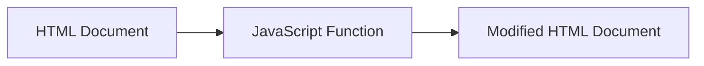
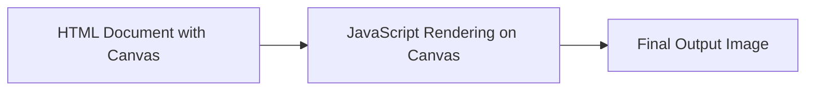
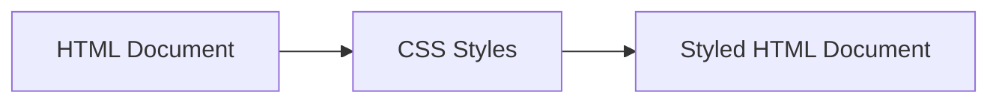
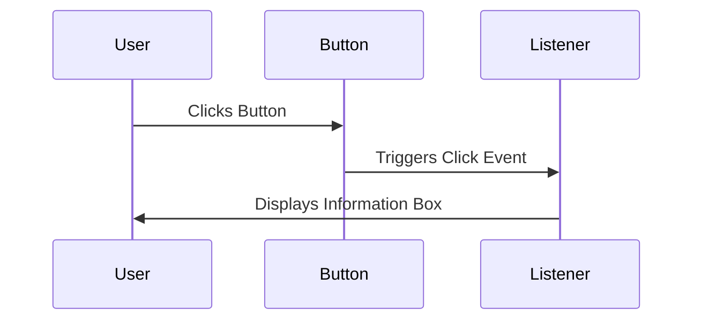
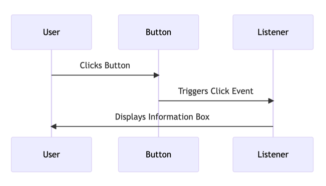
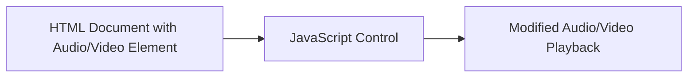
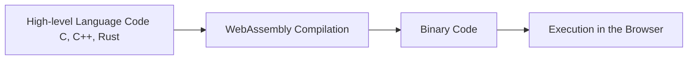
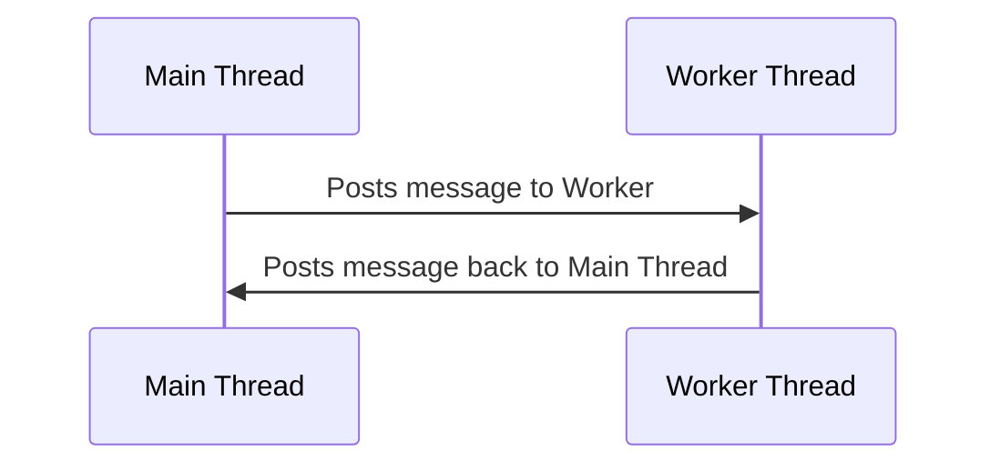

# HTML5: Powering Next-Generation Collaboration Systems

In the landscape of Unified Communication as a Service (UCaaS) and telecom solutions, HTML5 emerges as a powerful ally. The latest evolution of HTML, HTML5, is a core technology for constructing sophisticated web pages and web applications. Its expanded feature set presents a myriad of opportunities for creating interactive, real-time, and media-rich collaboration systems.

## HTML5 in the UCaaS Landscape

HTML5 marks a significant shift from static content towards a web filled with dynamic, interactive applications. New features, ranging from semantic improvements, real-time connectivity enhancements, multimedia capabilities, to device APIs, make it a competitive choice against proprietary tech like Flash or Silverlight.

Being an open standard, HTML5 is available across an extensive range of devices and platforms, ensuring your UCaaS offerings are broadly accessible without needing additional plugins or software.

## HTML5: Enabling Telecom Innovation

Leveraging HTML5 offers numerous advantages that revolutionize the way we build and interact with collaboration systems:

1. **Semantics**: HTML5 introduces elements like `<header>`, `<footer>`, `<article>`, and `<section>`, which enhance the structure and readability of web content, making UI development intuitive.

2. **Connectivity**: Real-time communication is critical in UCaaS, and HTML5's WebSocket API allows for bidirectional, full-duplex communication channels over a single TCP connection.

3. **Offline & Storage**: With enhanced client-side storage, HTML5 makes collaboration tools more robust and reliable.

4. **Multimedia**: HTML5 natively supports audio and video elements, eliminating the need for external plugins. This is especially useful in UCaaS products, where multimedia communication is key.

5. **2D/3D & Effects**: HTML5's canvas element, along with CSS3 and WebGL, enables creation of rich, interactive user interfaces, raising the bar for telecom collaboration systems.

## HTML5: Challenges and Solutions

Despite its potential, HTML5 comes with challenges:

1. **Browser Compatibility**: HTML5 features are not uniformly implemented across browsers or platforms, thus demanding careful planning and testing.

2. **Performance**: Complex operations, especially graphical ones, may not run smoothly on older devices, requiring performance optimization strategies.

3. **Security**: Ensuring privacy and security is paramount in UCaaS solutions. HTML5 features like offline storage and geolocation need careful handling.

Nevertheless, with comprehensive testing and good security practices, these challenges can be mitigated.

In the coming sections, we'll deep-dive into HTML5's capabilities in context of telecom collaboration systems. We'll explore practical use-cases, such as manipulating the DOM for dynamic content updates, leveraging the HTML5 Canvas for interactive UIs, customizing CSS for seamless user experience, employing JavaScript events and listeners for responsive interfaces, and utilizing HTML5's audio and video elements for multimedia communication.

## 1. Manipulating the DOM (Document Object Model)

In the context of web development, a "document" is the webpage loaded in the browser. The Document Object Model (DOM) is a programming interface for HTML and XML documents. It represents the structure of a document as a tree of objects. Each object, or "node" in this tree represents a part of the document (e.g., an element, an attribute, a piece of text, etc.). With the DOM, developers can manipulate the content and structure of the webpage with scripting languages like JavaScript.

**Mermaid Diagram Logic (Flowchart):**


**Practical Code Sample:**

```html
<!DOCTYPE html>
<html>
<body>
    <p id="demo">Hello, World!</p>
    <button onclick="changeText()">Click me</button>

    <script>
    function changeText() {
        document.getElementById("demo").innerHTML = "Hello, HTML5!";
    }
    </script>
</body>
</html>
```
When you click the button, the JavaScript function changes the text of the paragraph from 'Hello, World!' to 'Hello, HTML5!'.

## 2. Leveraging HTML5's Canvas

The canvas element is part of HTML5 and allows for dynamic, scriptable rendering of 2D shapes and bitmap images. It is a low-level, flexible graphical tool that you can use to create visual components like graphs or even game graphics.

**Mermaid Diagram Logic (Flowchart):**



**Practical Code Sample:**

```html
<!DOCTYPE html>
<html>
<body>
    <canvas id="myCanvas" width="500" height="500" style="border:1px solid #d3d3d3;">
    Your browser does not support the HTML5 canvas tag.
    </canvas>

    <script>
    var canvas = document.getElementById("myCanvas");
    var ctx = canvas.getContext("2d");
    ctx.beginPath();
    ctx.arc(95, 50, 40, 0, 2 * Math.PI);
    ctx.stroke();
    </script>
</body>
</html>
```
This example uses JavaScript to draw a circle on the canvas.

## 3. Customizing CSS (Cascading Style Sheets)

CSS, in combination with HTML5, can be used to create dynamic user interfaces with animations, transitions, and other visual effects. CSS is a stylesheet language used to describe the look and formatting of a document written in HTML.

**Mermaid Diagram Logic (Flowchart):**



**Practical Code Sample:**

```html
<!DOCTYPE html>
<html>
<head>
<style>
p {
  font-size: 20px;
  color: red;
  text-align: center;
}
</style>
</head>
<body>

<p>Hello, HTML5 and CSS!</p>

</body>
</html>
```
In this example, CSS is used to style a paragraph with red color, center alignment, and a font size of 20px.

## 4. Utilizing JavaScript Events and Listeners

Events are actions or occurrences that happen in the system you are programming, which the system tells you about so you can respond to them in some way if desired. For example, if

the user clicks a button on a webpage, you might want to respond to that action by displaying an information box.

JavaScript event listeners are functions that wait for these events to happen and then execute code in response.

**Mermaid Diagram Logic (Sequence Diagram):**




**Practical Code Sample:**

```html
<!DOCTYPE html>
<html>
<body>

<button onclick="displayAlert()">Click me</button>

<script>
function displayAlert() {
  alert("Hello, HTML5 and JavaScript!");
}
</script>

</body>
</html>
```
When you click the button, a JavaScript function is executed that displays an alert box with a message.

## 5. HTML5's Audio and Video elements

HTML5 introduced native Audio and Video elements which allow multimedia to be embedded directly into web pages. They can be controlled via JavaScript to create custom controls, autoplay features, and more.

**Mermaid Diagram Logic (Flowchart):**



**Practical Code Sample:**

```html
<!DOCTYPE html>
<html>
<body>

<audio id="myAudio" controls>
  <source src="audio.mp3" type="audio/mpeg">
  Your browser does not support the audio element.
</audio>

<button onclick="playAudio()" type="button">Play Audio</button>

<script>
function playAudio() { 
  document.getElementById("myAudio").play(); 
}
</script>

</body>
</html>
```
In this example, an audio file is embedded into the webpage, and a custom button is used to play the audio file using JavaScript.

## WebAssembly (Wasm)

WebAssembly is a binary instruction format that allows you to run code written in languages like C, C++, and Rust at near-native speed on the web. It's designed as a portable target for the compilation of high-level languages, enabling deployments on the web for client and server applications.

**Mermaid Diagram Logic (Flowchart):**



## Web Workers

Web Workers is a simple means for web content to run scripts in background threads. The worker thread can perform tasks without interfering with the user interface. In addition, they can perform I/O using XMLHttpRequest (although the responseXML and channel attributes are always null). Once created, a worker can send messages to the JavaScript code that created it by posting messages to an event handler specified by that code (and vice versa).

**Mermaid Diagram Logic (Sequence Diagram):**



**Practical JavaScript Code Sample:**

```javascript
// Main Thread
var worker = new Worker('worker.js');
worker.onmessage = function(event) {
    console.log("Received message " + event.data);
    doSomething();
}
worker.postMessage("Hello Worker!");  

// Inside worker.js (The Worker Thread)
self.onmessage = function(event) {
    console.log("Received message " + event.data);
    self.postMessage("Hello Main Thread!");
}
```

This code initiates a worker thread from a main JavaScript thread. The main thread sends a message "Hello Worker!" to the worker thread. The worker thread receives the message, logs it, and sends a message back to the main thread saying "Hello Main Thread!".

#### Rust WASM

Here's an example of compiling a Rust function to WebAssembly:

Let's say you have a simple Rust function that adds two numbers in a file named `lib.rs`:

```rust
pub fn add(a: i32, b: i32) -> i32 {
    a + b
}
```

To compile this Rust code to WebAssembly, you would first need to add a `Cargo.toml` file to define your Rust project:

```toml
[package]
name = "add"
version = "0.1.0"
edition = "2018"

[lib]
crate-type = ["cdylib"]

[dependencies]
```

You can then compile this project to WebAssembly using the `wasm-pack` tool with the following command:

```bash
wasm-pack build --target web
```

This command produces a `pkg` directory which includes the compiled WebAssembly code (`add_bg.wasm`), a JavaScript file (`add.js`) which you can use to import the WebAssembly module into a web page, and some other related files.

The `add.js` file could be used in a HTML file as shown below:

```html
<!DOCTYPE html>
<html>
<body>
<script type="module">
import init, { add } from './pkg/add.js';

async function run() {
   await init();
   console.log(add(1, 2)); // logs "3"
}

run();

</script>
</body>
</html>
```

In this example, the WebAssembly module is loaded asynchronously with `init()`, and then the `add()` function exported from the Rust code is used to add two numbers. Note that all the wasm related operations should be done in asynchronous manner.

Make sure to have the necessary tools installed and set up, such as the Rust compiler and `wasm-pack`, and to serve the HTML file from a local server due to browser security restrictions.