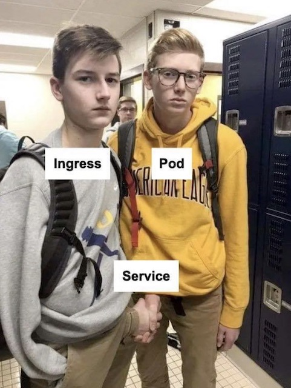

In Kubernetes (K8s), Deployments, Services, and Pods are core building blocks used to deploy and manage containerized applications. Here's a brief explanation of each component and some examples and use-cases:

Here's a diagram that illustrates the relationship between Deployment, Pod, Container, Services, Ingress Controller, and Ingress in Kubernetes:

```
                                      +---------------------+
                                      |    Ingress          |
                                      |                     |
                                      | Rules               |
                                      |   /path1 -> Service1 |
                                      |   /path2 -> Service2 |
                                      |                     |
                                      +---------------------+
                                               ^
                                               |
                                               |
                                               |
                    +--------------------------+-------------------------+
                    |                                                     |
                    |                       Ingress Controller            |
                    |                                                     |
                    |      +----------------+              +-----------+ |
                    |      |  Service1      |              | Service2  | |
                    |      |                |              |           | |
                    |      |  Selector:     |              | Selector: | |
                    |      |    app: app1   |              | app: app2 | |
                    |      +----------------+              +-----------+ |
                    |                    ^                          ^    |
                    |                    |                          |    |
                    |                    |                          |    |
     +--------------+-------------+     |             +------------+----+---------------------+
     |                             |     |             |                                          |
     |          Deployment         |     |             |                                          |
     |                             |     |             |                                          |
     | +----------------------+   |     |  +----------+----------+   +----------------------+ |
     | |       Pod1           |   |     |  |         Pod2         |   |       Pod3           | |
     | |                      |   |     |  |                      |   |                      | |
     | | +------------------+ |   |     |  | +------------------+ |   | +------------------+ | |
     | | |   Container1     | |   |     |  | |   Container2     | |   | |    Container3    | | |
     | | |                  | |   |     |  | |                  | |   | |                  | | |
     | | |   Image: image1  | |   |     |  | |   Image: image2  | |   | |   Image: image3  | | |
     | | |                  | |   |     |  | |                  | |   | |                  | | |
     | | +------------------+ |   |     |  | +------------------+ |   | +------------------+ | |
     | +----------------------+   |     |  +----------------------+   +----------------------+ |
     +------------------------------+     +----------------------------------------------------+

```

Explanation:

- A Deployment manages a set of replicas of a single application, and is responsible for ensuring that the desired number of replicas are running at all times.
- Each replica is represented by a Pod, which contains one or more containers that run the application.
- Services provide a stable IP address and DNS name for a set of Pods, and allow communication between them within the cluster.
- An Ingress Controller is responsible for managing ingress traffic into the cluster, and typically routes traffic to Services based on the rules defined in an Ingress resource.
- An Ingress resource defines rules for how traffic should be routed to Services based on the path and host of the incoming request.

In summary, the diagram shows how all these components work together to provide a scalable and reliable application deployment and service in Kubernetes.

1. Deployments:

   Deployments are used to manage the lifecycle of Pods, which are the smallest deployable units in Kubernetes. Deployments ensure that a specified number of replica Pods are running at any given time, and they also handle updates and rollbacks of your application. Deployments are often used for stateless applications, such as web servers, that can scale horizontally to handle increased traffic.

   Example: A Deployment that manages a set of three replicas of a web server Pod:

   ```yaml
   apiVersion: apps/v1
   kind: Deployment
   metadata:
     name: web-server
   spec:
     replicas: 3
     selector:
       matchLabels:
         app: web-server
     template:
       metadata:
         labels:
           app: web-server
       spec:
         containers:
         - name: web-server
           image: my-web-server-image
           ports:
           - containerPort: 80
   ```

2. Services:

   Services are used to provide a stable network endpoint for Pods, allowing them to communicate with each other and with other services in the cluster. Services can be exposed within the cluster or externally, and they can be load-balanced across multiple Pods. Services are often used for stateful applications, such as databases, that require stable network addresses and persistent storage.

   Example: A Service that exposes the web server Pods from the previous example:

   ```yaml
   apiVersion: v1
   kind: Service
   metadata:
     name: web-server-service
   spec:
     selector:
       app: web-server
     ports:
     - name: http
       port: 80
       targetPort: 80
     type: ClusterIP
   ```

3. Pods:

   Pods are the smallest deployable units in Kubernetes and consist of one or more containers. Pods share a network namespace and can share storage volumes, making it easy for containers to communicate with each other and share data. Pods are often used for running a single container or a small set of tightly-coupled containers.

   Example: A Pod that runs a single container with a web server:

   ```yaml
   apiVersion: v1
   kind: Pod
   metadata:
     name: web-server-pod
   spec:
     containers:
     - name: web-server
       image: my-web-server-image
       ports:
       - containerPort: 80
   ```

Use-cases:

- Deployments are used for stateless applications that can scale horizontally.
- Services are used for providing stable network endpoints for applications and load-balancing traffic.
- Pods are used for running a single container or a small set of tightly-coupled containers. They are often used for stateful applications that require persistent storage and stable network addresses.

Together, Deployments, Services, and Pods provide a flexible and powerful way to manage containerized applications in Kubernetes.

## Ingress



In Kubernetes, an Ingress is an API object that manages external access to the services in a cluster. It provides a way to route incoming requests to different services based on the requested URL, hostname, or other attributes of the request. The Ingress resource also allows for SSL termination, load balancing, and other features that are commonly needed for serving web applications.

In Google Kubernetes Engine (GKE), an Ingress controller is a software component that runs as a pod in the cluster and handles the requests that come into the cluster's HTTP(S) load balancer. The Ingress controller reads the Ingress resource configuration and uses it to configure the load balancer and routing rules.

To demonstrate how an Ingress works in GKE with a Service, let's consider a simple example. Suppose you have a Kubernetes cluster running on GKE, and you have two Services deployed in the cluster: a frontend Service and a backend Service. The frontend Service exposes a web interface that users can access, and the backend Service provides an API for the frontend to use.

To expose these Services to the public internet, you can create an Ingress resource that routes incoming requests to the appropriate Service based on the requested URL. Here's an example Ingress resource configuration:

```
apiVersion: networking.k8s.io/v1
kind: Ingress
metadata:
  name: my-ingress
  annotations:
    kubernetes.io/ingress.class: "gce"
spec:
  rules:
  - host: example.com
    http:
      paths:
      - path: /frontend
        pathType: Prefix
        backend:
          service:
            name: frontend-service
            port:
              name: http
      - path: /api
        pathType: Prefix
        backend:
          service:
            name: backend-service
            port:
              name: http
```

This Ingress configuration specifies that requests to `example.com/frontend` should be routed to the `frontend-service`, and requests to `example.com/api` should be routed to the `backend-service`. The `pathType: Prefix` option means that the Ingress controller should match any request that starts with the specified path.

To enable SSL termination for the Ingress, you can also add an SSL certificate to the configuration:

```
apiVersion: networking.k8s.io/v1
kind: Ingress
metadata:
  name: my-ingress
  annotations:
    kubernetes.io/ingress.class: "gce"
    cert-manager.io/cluster-issuer: "letsencrypt-prod"
spec:
  tls:
  - hosts:
    - example.com
    secretName: example-tls
  rules:
  - host: example.com
    http:
      paths:
      - path: /frontend
        pathType: Prefix
        backend:
          service:
            name: frontend-service
            port:
              name: http
      - path: /api
        pathType: Prefix
        backend:
          service:
            name: backend-service
            port:
              name: http
```

This Ingress configuration specifies that requests to `example.com` should be served over HTTPS using a TLS certificate obtained from the Let's Encrypt CA through the cert-manager tool.

Overall, an Ingress provides a powerful way to expose Kubernetes Services to the public internet, while also providing features such as SSL termination, load balancing, and fine-grained routing rules.

In addition to the basic functionality described above, GKE provides several advanced options for using Ingress that can help you to customize the behavior of your applications and optimize performance. Here are some examples:

1. BackendConfig: The BackendConfig resource is an extension to the Kubernetes Ingress that allows you to customize the behavior of your backends. With BackendConfig, you can set custom request headers, timeouts, and other parameters for your backend services. For example, you can configure a custom response timeout for a backend that takes longer to respond than other backends in the cluster.

2. Ingress annotations: GKE supports several annotations that you can add to your Ingress resources to customize their behavior. Some of the most commonly used annotations include:

- `nginx.ingress.kubernetes.io/ssl-redirect`: Redirect HTTP requests to HTTPS.
- `kubernetes.io/ingress.class`: Select which ingress controller to use. For example, `nginx` or `gce`.
- `nginx.ingress.kubernetes.io/rewrite-target`: Rewrite the URL before forwarding it to the backend service.
- `nginx.ingress.kubernetes.io/affinity`: Control how client requests are distributed to backend pods. For example, using cookie-based session affinity.

3. Ingress controllers: In addition to the default GKE Ingress controller, you can also use third-party Ingress controllers such as Traefik or Istio. These controllers provide additional features such as rate limiting, traffic splitting, and advanced security features.

4. Managed certificates: GKE supports automatic provisioning and renewal of TLS certificates through the Google-managed Certificate Authority. By configuring your Ingress resources to use managed certificates, you can simplify the management of your SSL certificates and ensure that they are always up to date.

   Managed certificates in GCP can be managed using the `gcloud` command-line tool. Here's an example of how to create a managed certificate for a domain using `gcloud`:

    4.1. First, you need to enable the Managed Certificates API by running the following command:
    
       ```
       gcloud services enable managedidentities.googleapis.com
       ```
    
    4.2. Next, create a managed certificate using the following command:
    
       ```
       gcloud beta compute ssl-certificates create [CERTIFICATE_NAME] \
           --domains=[DOMAIN_NAME] \
           --project=[PROJECT_ID] \
           --global \
           --purpose=MANAGED \
           --visibility=global
       ```
    
       Replace `[CERTIFICATE_NAME]` with a name for your certificate, `[DOMAIN_NAME]` with the domain name that the certificate will cover, and `[PROJECT_ID]` with the ID of the GCP project you're working in. The `--purpose=MANAGED` flag tells GCP that this is a managed certificate, and the `--visibility=global` flag makes the certificate available globally.
    
    4.3. Once the certificate is created, you can assign it to an HTTPS load balancer by adding it to the load balancer's frontend configuration. Here's an example of how to do this:
    
       ```
       gcloud compute target-https-proxies update [TARGET_PROXY_NAME] \
           --ssl-certificates=[CERTIFICATE_NAME] \
           --global \
           --project=[PROJECT_ID]
       ```
    
       Replace `[TARGET_PROXY_NAME]` with the name of the HTTPS target proxy you want to update, and `[CERTIFICATE_NAME]` with the name of the managed certificate you just created.
    
    4.4 You can verify that the certificate is working by visiting your website over HTTPS and checking that the browser indicates that the connection is secure.
    
    Managed certificates in GCP provide an easy way to obtain and manage SSL certificates for your domains. With `gcloud`, you can create and manage these certificates from the command line, and easily assign them to your load balancers for secure HTTPS connections.

5. Network policies: GKE supports Kubernetes Network Policies, which allow you to control traffic flow between different pods and namespaces in your cluster. By using Network Policies in conjunction with Ingress, you can create fine-grained access controls for your applications.

Overall, these advanced options provide a powerful set of tools for customizing the behavior of your Ingress resources and optimizing the performance and security of your applications running on GKE.

## Pods in detail

In Kubernetes, a Pod is the smallest unit of deployment and represents a single instance of a running process. Pods are used to host containers, and they can have one or more containers running within them. Each Pod has a set of configuration parameters that define how the Pod should be created and managed. Here's a detailed explanation of the configuration parameters of a Pod in Kubernetes:

1. Metadata:

   Metadata is used to label and annotate a Pod, which can be used for various purposes such as grouping, searching, or debugging. The metadata field in a Pod definition includes the Pod's name, labels, and annotations.

2. Spec:

   The spec field is the most important section of a Pod definition, as it contains all the configuration parameters that define how the Pod should be created and managed. Here are some of the important parameters in the spec field:

   - Containers:

     The containers field is an array of container definitions, which specify the image to run, command to execute, and resources to allocate to the container. A Pod can have one or more containers running within it, and each container runs in its own namespace.

   - Volumes:

     The volumes field is an array of volume definitions, which specify the storage to be used by the containers. Volumes can be used to store data that needs to persist beyond the lifetime of a container or to share data between containers within a Pod.

   - Restart Policy:

     The restartPolicy field specifies what should happen if a container in the Pod exits. The options are Always, OnFailure, and Never. If set to Always, the container will be restarted regardless of the exit code. If set to OnFailure, the container will only be restarted if it exits with a non-zero exit code. If set to Never, the container will not be restarted.

   - Node Selector:

     The nodeSelector field is used to schedule the Pod on a specific node in the cluster based on the node's labels. For example, you can specify a nodeSelector that ensures the Pod is only scheduled on nodes with specific hardware characteristics.

   - Affinity and Anti-Affinity:

     Affinity and anti-affinity rules are used to control how Pods are scheduled based on their relationships with other Pods. Affinity rules ensure that Pods are scheduled on nodes with specific characteristics, while anti-affinity rules ensure that Pods are not scheduled on the same node as other Pods.

   - Tolerations:

     Tolerations are used to specify that a Pod can be scheduled on a node that has a specific taint. Taints are used to mark nodes as unsuitable for certain Pods, and tolerations are used to override these taints.

3. Status:

   The status field provides information about the current state of the Pod, including the Pod's IP address, phase, and the status of its containers.

In summary, the configuration parameters of a Pod in Kubernetes include metadata, spec, and status fields. The spec field is the most important section of a Pod definition and includes parameters such as containers, volumes, restart policy, node selector, affinity and anti-affinity rules, and tolerations. The status field provides information about the current state of the Pod, including its IP address, phase, and the status of its containers.

Here's an example of using all containers configuration parameters in a Pod:

```
apiVersion: v1
kind: Pod
metadata:
  name: my-pod
spec:
  containers:
  - name: container-1
    image: nginx:latest
    command: ["sh", "-c", "echo Hello from Container 1"]
    env:
    - name: ENV_VAR_1
      value: "123"
    - name: ENV_VAR_2
      value: "456"
    ports:
    - containerPort: 80
    resources:
      limits:
        cpu: "0.5"
        memory: "512Mi"
      requests:
        cpu: "0.25"
        memory: "256Mi"
    volumeMounts:
    - name: data-volume
      mountPath: /data
  - name: container-2
    image: mysql:5.7
    command: ["sh", "-c", "echo Hello from Container 2"]
    env:
    - name: MYSQL_ROOT_PASSWORD
      value: "password123"
    ports:
    - containerPort: 3306
    resources:
      limits:
        cpu: "1"
        memory: "1Gi"
      requests:
        cpu: "0.5"
        memory: "512Mi"
    volumeMounts:
    - name: data-volume
      mountPath: /data
  volumes:
  - name: data-volume
    emptyDir: {}
```

In the above example, we have a Pod named `my-pod` that contains two containers: `container-1` and `container-2`. Here's a breakdown of all the containers configuration parameters used in this example:

- **name**: The name of the container.

- **image**: The Docker image to be used for the container.

- **command**: The command to be executed when the container starts.

- **env**: Environment variables to be set inside the container.

- **ports**: The ports to be exposed by the container.

- **resources**: The resource limits and requests for the container, specifying the CPU and memory allocation.

- **volumeMounts**: The volumes that the container needs to mount to access data.

- **volumes**: The volumes to be used by the Pod.

In this example, `container-1` runs the Nginx web server and `container-2` runs the MySQL database server. Both containers have a command defined that echoes a message when the container starts. Each container also has environment variables set, ports exposed, and resource limits and requests defined. Additionally, both containers mount the same volume named `data-volume` to access shared data.

The `volumes` field in the Pod's spec section defines the `data-volume` volume as an empty directory. This volume is then mounted to both containers using the `volumeMounts` field. By using volumes, we can ensure that data is persisted and can be shared between containers even if they are restarted or rescheduled on a different node.

By using all these containers configuration parameters in a Pod, we can create complex multi-container applications that work together to provide a complete solution.

### Resources

In Kubernetes, resources are used to specify the CPU and memory requirements of a container. This helps Kubernetes to schedule containers onto nodes that have the necessary resources available to run the container. In this context, resources refer to the amount of computing power that a container requires to function properly.

Here are some examples of how to define resource limits and requests for a container:

```
apiVersion: v1
kind: Pod
metadata:
  name: my-pod
spec:
  containers:
  - name: my-container
    image: nginx:latest
    resources:
      limits:
        cpu: "0.5"
        memory: "512Mi"
      requests:
        cpu: "0.25"
        memory: "256Mi"
```

In this example, we're defining a Pod named `my-pod` with a single container named `my-container`. We're using the `resources` field to define the resource limits and requests for the container.

The `limits` field specifies the maximum amount of CPU and memory that the container can use. In this example, the container can use up to 0.5 CPU cores and 512 megabytes of memory.

The `requests` field specifies the minimum amount of CPU and memory that the container requires. In this example, the container requires at least 0.25 CPU cores and 256 megabytes of memory.

By specifying resource limits and requests, we can ensure that the container has the resources it needs to function properly, while also preventing it from using too many resources and affecting the performance of other containers or the overall system.

Here's another example that illustrates the use of CPU and memory requests and limits:

```
apiVersion: v1
kind: Pod
metadata:
  name: my-pod
spec:
  containers:
  - name: my-container
    image: busybox:latest
    resources:
      limits:
        cpu: "1"
        memory: "256Mi"
      requests:
        cpu: "0.5"
        memory: "128Mi"
    command: ["sleep", "3600"]
```

In this example, we're defining a Pod named `my-pod` with a single container named `my-container`. We're using the `resources` field to define the resource limits and requests for the container.

The `limits` field specifies that the container can use up to 1 CPU core and 256 megabytes of memory. The `requests` field specifies that the container requires at least 0.5 CPU cores and 128 megabytes of memory.

In this example, the container is running the `sleep` command to simulate a long-running process. By defining the resource limits and requests, we can ensure that the container has the necessary resources to run the `sleep` command for an extended period of time without affecting the performance of other containers or the overall system.

In summary, resources in containers are used to specify the CPU and memory requirements of a container, which helps Kubernetes to schedule containers onto nodes with the necessary resources available. By properly defining resource limits and requests, we can ensure that containers have the resources they need to function properly, while also preventing them from using too many resources and affecting the performance of other containers or the overall system.


## Advanced Pod configurations

In GKE, you can configure various options for your Kubernetes pods, such as the restart policy, node selector, affinity, and tolerations.

1. Restart Policy:
   The restart policy specifies what should happen if a container in the pod fails or exits. The three available options for restart policy are:
- Always: Restart the container after it exits, regardless of the exit code.
- OnFailure: Restart the container only if it exits with a non-zero exit code.
- Never: Do not restart the container after it exits, regardless of the exit code.

Here's an example that sets the restart policy to "Always":

```
apiVersion: v1
kind: Pod
metadata:
  name: my-pod
spec:
  restartPolicy: Always
  containers:
  - name: my-container
    image: nginx:latest
```

2. Node Selector:
   A node selector is used to specify the nodes on which the pod should be scheduled. You can use labels and selectors to specify node selectors.

Here's an example that uses a label selector to schedule the pod on nodes with the label "zone=us-west1":

```
apiVersion: v1
kind: Pod
metadata:
  name: my-pod
spec:
  nodeSelector:
    zone: us-west1
  containers:
  - name: my-container
    image: nginx:latest
```

3. Affinity:
   Affinity is used to specify rules for how pods should be scheduled based on the presence or absence of other pods or nodes in the cluster. Affinity can be used to ensure that related pods are scheduled on the same node or different nodes.

Here's an example that uses affinity to ensure that the pod is scheduled on the same node as another pod with the label "app=my-app":

```
apiVersion: v1
kind: Pod
metadata:
  name: my-pod
spec:
  affinity:
    podAffinity:
      requiredDuringSchedulingIgnoredDuringExecution:
      - labelSelector:
          matchExpressions:
          - key: app
            operator: In
            values:
            - my-app
        topologyKey: "kubernetes.io/hostname"
  containers:
  - name: my-container
    image: nginx:latest
```

In this example, we're using pod affinity to ensure that the pod is scheduled on the same node as another pod with the label "app=my-app". The `topologyKey` specifies that we want the pods to be scheduled on nodes with the same hostname.

4. Tolerations:
   Tolerations are used to allow a pod to be scheduled on a node that has a taint applied to it. Taints are used to mark nodes that should not accept pods unless the pods have a corresponding toleration.

Here's an example that uses tolerations to allow the pod to be scheduled on a node with a taint applied to it:

```
apiVersion: v1
kind: Pod
metadata:
  name: my-pod
spec:
  tolerations:
  - key: "example.com/my-taint"
    operator: "Equal"
    value: "true"
    effect: "NoSchedule"
  containers:
  - name: my-container
    image: nginx:latest
```

In this example, we're using a toleration to allow the pod to be scheduled on a node with the taint "example.com/my-taint=true". The `effect` specifies that we don't want any pods to be scheduled on nodes with this taint unless they have a toleration that matches it.

In summary, restart policy, node selector, affinity, and tolerations are all important options that can be configured for GKE pods. By properly configuring these options

## Mutating Controllers

In Kubernetes, a controller is a control loop that continuously monitors the state of the cluster and takes action to reconcile the desired state with the current state. Controllers are responsible for maintaining the desired state of various Kubernetes resources, such as Pods, Deployments, ReplicaSets, Services, and ConfigMaps.

In GCP, you can use Kubernetes controllers to manage and deploy your applications on Google Kubernetes Engine (GKE). Here are some examples of Kubernetes controllers that you can use in GCP:

1. Deployment controller: This controller manages the lifecycle of a Deployment resource in Kubernetes. It ensures that the desired number of replicas of the application are running, and takes action to scale up or down as necessary.

Example: To create a Deployment in GCP, you can use the following `kubectl` command:

```
kubectl create deployment myapp --image=gcr.io/myproject/myapp:v1
```

This command will create a Deployment resource for the `myapp` application, using the `gcr.io/myproject/myapp:v1` container image.

2. StatefulSet controller: This controller is used to manage stateful applications that require unique network identities and stable storage. It ensures that each Pod in the StatefulSet has a unique hostname and stable network identity.

Example: To create a StatefulSet in GCP, you can use the following `kubectl` command:

```
kubectl create statefulset myapp --image=gcr.io/myproject/myapp:v1 --replicas=3
```

This command will create a StatefulSet resource for the `myapp` application, using the `gcr.io/myproject/myapp:v1` container image, and running 3 replicas of the application.

3. DaemonSet controller: This controller is used to ensure that a particular Pod runs on all nodes in the cluster. It is typically used for system-level daemons, such as log collectors or monitoring agents.

Example: To create a DaemonSet in GCP, you can use the following `kubectl` command:

```
kubectl create daemonset myapp --image=gcr.io/myproject/myapp:v1
```

This command will create a DaemonSet resource for the `myapp` application, using the `gcr.io/myproject/myapp:v1` container image.

In summary, Kubernetes controllers are essential components of the Kubernetes architecture that enable you to manage and deploy your applications on GCP. By using these controllers, you can ensure that your applications are running in the desired state, and that they are resilient and scalable in the face of changing demand.


### Mutating Controller

A mutating webhook controller is a Kubernetes controller that intercepts requests to create, update, or delete Kubernetes resources and mutates them by modifying their specifications or adding additional objects to them. Mutating webhook controllers can be used to inject sidecar containers, add annotations or labels, or modify the specifications of the resources being created or updated.

To write a mutating webhook controller for Kubernetes to inject a container into each deployment, you will need to create a web server that listens for admission requests from the Kubernetes API server. When an admission request is received, the controller will examine the request to determine whether it is a request to create or update a deployment object. If the request is a deployment object, the controller will add a new container to the deployment object's specification.

Here's an example of how to write a mutating webhook controller for Kubernetes to inject a container into each deployment using Golang and the Kubernetes client-go library:

```go
package main

import (
	"context"
	"encoding/json"
	"flag"
	"fmt"
	"net/http"
	"os"

	"k8s.io/api/admission/v1beta1"
	"k8s.io/apimachinery/pkg/runtime"
	"k8s.io/apimachinery/pkg/runtime/serializer"
	"k8s.io/client-go/kubernetes"
	"k8s.io/client-go/rest"
	"k8s.io/client-go/tools/clientcmd"
	"k8s.io/client-go/util/homedir"
	"k8s.io/klog"
)

var (
	kubeconfig string
)

func main() {
	// Parse command line flags
	flag.StringVar(&kubeconfig, "kubeconfig", getKubeConfig(), "Path to kubeconfig file")
	flag.Parse()

	// Initialize Kubernetes client
	config, err := clientcmd.BuildConfigFromFlags("", kubeconfig)
	if err != nil {
		klog.Fatalf("Error building config from flags: %v", err)
	}
	clientset, err := kubernetes.NewForConfig(config)
	if err != nil {
		klog.Fatalf("Error creating Kubernetes client: %v", err)
	}

	// Create HTTP server and handle admission requests
	http.HandleFunc("/", func(w http.ResponseWriter, r *http.Request) {
		handleAdmissionRequest(w, r, clientset)
	})
	klog.Infof("Listening on :8443")
	err = http.ListenAndServeTLS(":8443", "tls.crt", "tls.key", nil)
	if err != nil {
		klog.Fatalf("Error starting HTTP server: %v", err)
	}
}

func handleAdmissionRequest(w http.ResponseWriter, r *http.Request, clientset *kubernetes.Clientset) {
	// Read admission request from request body
	var body []byte
	if r.Body != nil {
		defer r.Body.Close()
		body, _ = io.ReadAll(r.Body)
	}
	admissionReview := v1beta1.AdmissionReview{}
	deserializer := serializer.NewCodecFactory(runtime.NewScheme()).UniversalDeserializer()
	_, _, err := deserializer.Decode(body, nil, &admissionReview)
	if err != nil {
		klog.Errorf("Error decoding admission review: %v", err)
		w.WriteHeader(http.StatusBadRequest)
		return
	}

	// Handle mutation of deployment objects
	if admissionReview.Request.Kind.Kind == "Deployment" {
		deployment := &appsv1.Deployment{}
		err := json.Unmarshal(admissionReview.Request.Object.Raw, deployment)
		if err != nil {
			klog.Errorf("Error unmarshalling deployment: %v", err)
			w.WriteHeader(http.StatusBadRequest)
			return
		}

		// Add a new container to the deployment
		deployment.Spec.Template.Spec.Containers = append(deployment.Spec.Template.Spec.Containers, corev1.Container{
			Name:  "injected-container",
			Image: "nginx:latest",
			Ports: []corev1.ContainerPort{
				{
					ContainerPort: 80,
					Name:          "http",
				},
			},
		})

		// Marshal the mutated deployment and create the admission response
		marshaledDeployment, err := json.Marshal(deployment)
		if err != nil {
			klog.Errorf("Error marshalling mutated deployment: %v", err)
			w.WriteHeader(http.StatusInternalServerError)
			return
		}
		patchType := v1beta1.PatchTypeJSONPatch
		patchBytes, err := json.Marshal([]map[string]interface{}{
			{
				"op":    "replace",
				"path":  "/spec/template/spec/containers",
				"value": marshaledDeployment,
			},
		})
		if err != nil {
			klog.Errorf("Error marshalling patch bytes: %v", err)
			w.WriteHeader(http.StatusInternalServerError)
			return
		}
		admissionResponse := v1beta1.AdmissionResponse{
			Allowed:   true,
			Patch:     patchBytes,
			PatchType: &patchType,
		}
		admissionReview.Response = &admissionResponse
	}

	// Write admission response to response writer
	resp, err := json.Marshal(admissionReview)
	if err != nil {
		klog.Errorf("Error marshalling admission review response: %v", err)
		w.WriteHeader(http.StatusInternalServerError)
		return
	}
	w.WriteHeader(http.StatusOK)
	if _, err := w.Write(resp); err != nil {
		klog.Errorf("Error writing admission review response: %v", err)
	}
}

func getKubeConfig() string {
	if home := homedir.HomeDir(); home != "" {
		return fmt.Sprintf("%s/.kube/config", home)
	}
	return ""
}
```

This code sets up an HTTP server that listens for admission requests from the Kubernetes API server. When an admission request is received, the controller checks whether it is a request to create or update a deployment object. If it is, the controller adds a new container to the deployment object's specification.

Note that in order for the controller to be able to intercept admission requests, a Kubernetes MutatingWebhookConfiguration resource must be created that points to the controller's URL. Additionally, the controller must be deployed in the same Kubernetes cluster as the resources it is modifying.