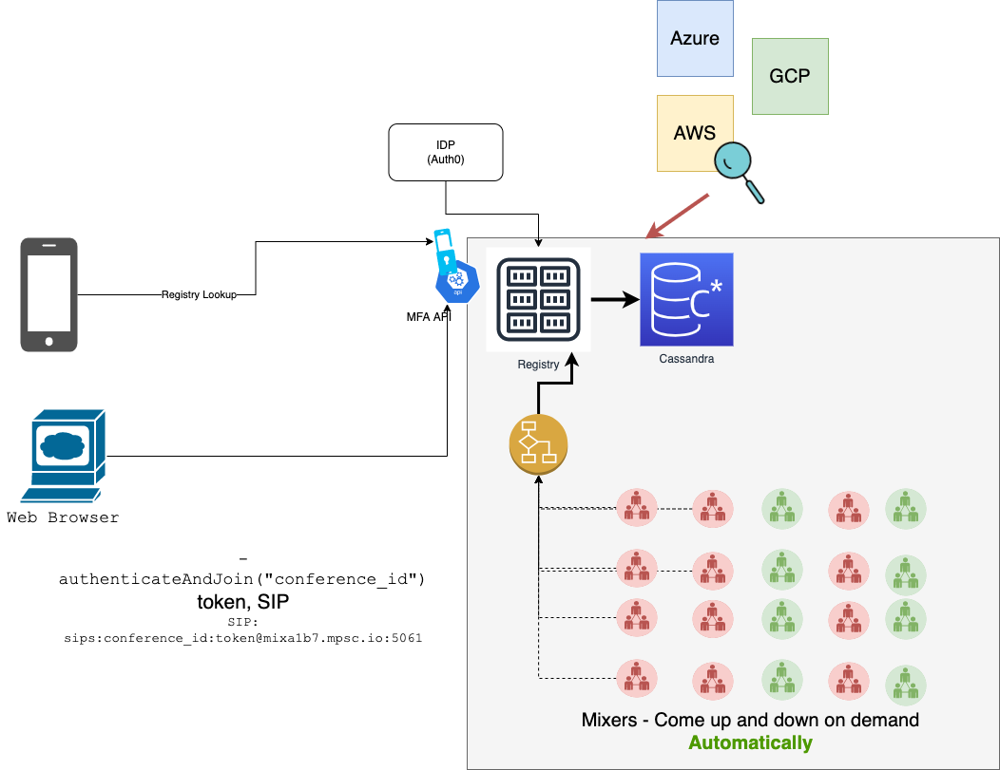
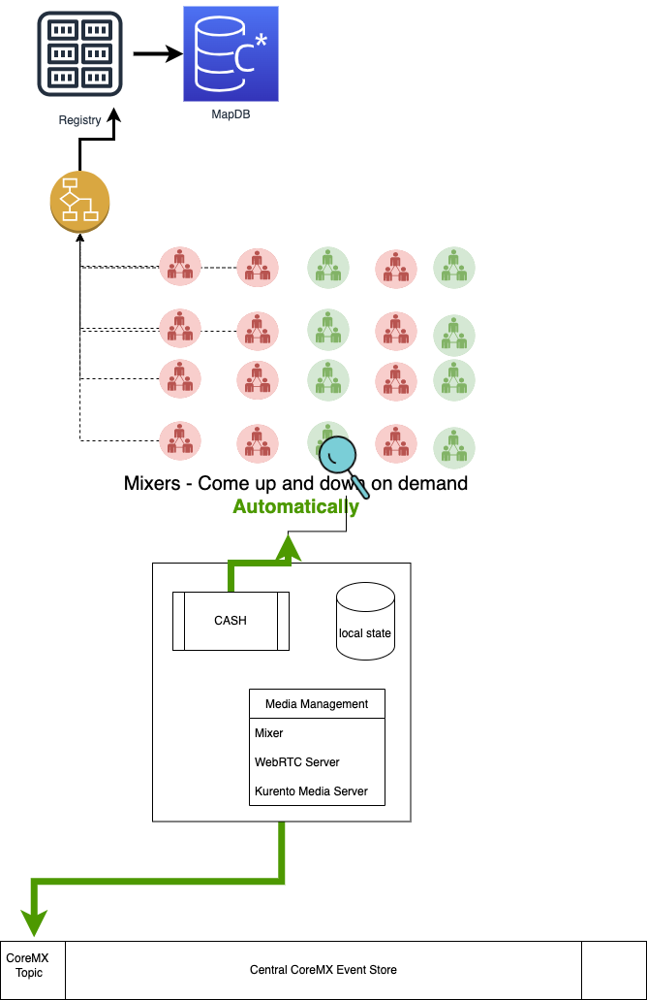

# CoreMX Cloud Connectivity Pattern 

CoreMX is designed to be cloud-agnostic and independently deployable in any cloud kubernetes offering.
This means that the microservices that orchestrate the system of multiple CoreMX instances are described as cloud-native k8s manifests and can be tested in Minikube as well as Enterprise Offering of Cloud. 

## Components

### Registry Node

A registry node is a globally well-known node, with each one operating as a priority based failover of each other. These nodes are designed to run as long-running (server-like) instances (using the Deployment type of k8s ) with multiple idempotent instances serving each registry node.
Each cloud-deployment will have 1-2 registry nodes with well known URLs. In an ideal system we would have several registry nodes with following URLs
```go
var RegistryURLs = []string {
"reg-c1-1.hoot.mx",
"reg-c1-2-hoot.mx",
"reg-c2-1-hoot.mx",
...
}
```

The format depicts: `reg-[cloud-identifier]-[priority].hoot.mx`

Components in each cloud will try reaching their local registry node before falling back on the list of global well known ones with priority. 


## Registry Node - Persistence

The persistence layer for the idempotent instances of the registry node is a document based database which is another cloud-agnostic deployment. IOW, the persistence layer isnt deployed in the same cloud, we're using Atlas Mongo as the cloud-agnostic persistence layer.

## Auth Service

Auth Service is another highly scalable idempotent service which analyses the inbound authentication token and infers information payload for future decisions. It also stamps the payload with other metadata in relation to the user's account.
Within a cluster, the auth-service can be reached by following URL.

`https://auth-service.hoox.svc`

This is not exposed externally and only accessible from within the k8s cluster. 

## CoreMX

CoreMX is an independent instance within a kubernetes pod or virtual-machine, which can do all the aspects of conference-managment and control.
CoreMX can be broken down into logical components which are tightly coupled with each other.

- Media Mixer
- WebRTC engine
- Kurento Media Server
- CoreMX API Service Helper (CASH)

### CASH Service

The CASH is responsible for initialising the entire system and reporting the health and availability to the local registry nodes.

All the functionality for a CoreMX is requested via the API provided by CASH. CASH will do its independent auth verification for each request and may perform reasonable caching.

CASH will be able to control the participants in any conference run by its corresponding CoreMX.




# User-Experience
A user either creates a conference or joins a conference.
To perform any actions, the user needs to authenticate with the system and obtain a short-lived (8 hours) token. 
All the actions in that session of 8 hours will be performed using that token.

### Create
The user creates a new conference with a unique "conference_id" and allows certain identities (users) to join the conference.
This conference will also have a unique address which is propagated to all registries:

`hoot.mx://conference_id@mixeraddress.hoot.mx`

### Join
The user connects with the nearest registry and asks to join.
`hoot.mx://conference_id@mixeraddress.hoot.mx`

The registry checks the entitlement against the conference for that user and then allows or rejects the user to join. The user will be given a unique web-URL to join the conference.

# Connectivity Pattern

## Global State

Global Conference State is managed and propagated using 2 independent systems.

- Global CoreMX Advertisement State ( GCAS )
- Central CoreMX Event Store ( CCES )

## GCAS - Global CoreMX Advertisement State
This is a map each registry nodes stores within itself. The map is a key:value pair, with

- key : the globally well-known registry node
- value : list of CoreMX within its cloud.

`GCAS: map[registry.node]: [list[CoreMX]]`

GCAS:
```
{
'self': {registry_meta, list[CoreMX]},
'reg-c1-2-hoot.mx': {registry_meta, list[CoreMX]},
...
}
```
2 or more registry nodes in the same cloud will have an identical map.
The GCAS exchange with registry nodes is triggered upon a timeout or activity in local cloud (whichever happens earlier) periodically.

### Features of GCAS Exchange

Triggered upon a regular last_update timeout or local core-mx event. Each update, triggers a reconciliation.
The truth is decided by recency of information and number of nodes informing the same information.

This is an **eventually consistent** system.


## CCES - Central CoreMX Event Store
The CCES is a highly available Kafka event store with each CoreMX as its own topic. One can subscribe to the topic for all the events on the CoreMX conference and relay its interface with updates.
CoreMX Connectivity

CoreMX's main interface to the world is `CASH`. `CASH` is the first service to be initialised when CoreMX is commissioned.

CASH links up to cloud local registry service and updates about its health and state. CASH informs all about the resource usage and availability patterns of the CoreMX. IOW - CASH is responsible for preventing the CoreMX from getting overwhelmed.



## Overall Flow

1. Registry Identification - identify the registry based on a pre-defined list or use a iroulette service (intelligent-roulette) to identify the best resgistry for you based on your location and other factors.
2. Call Orchestration - Initiate call-orchestration APIs ( create , join etc). . Call Control - Based on the CoreMX's direct URL, initiate call control APIs.